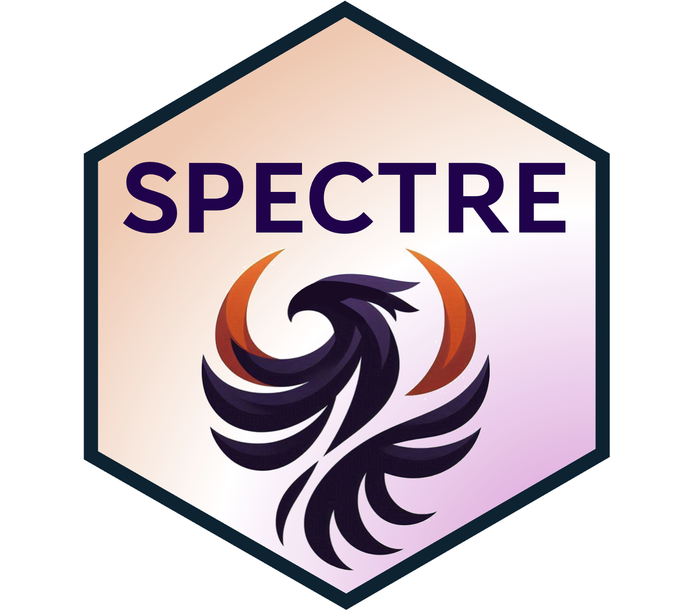

# Spectre 

A computational toolkit in R for the integration, exploration, and analysis of high-dimensional single-cell cytometry and imaging data.

**Current version**: [`v1.3.0`](https://github.com/ImmuneDynamics/Spectre/releases)

[](https://github.com/ImmuneDynamics/Spectre/actions/workflows/check-standard.yaml)
[](https://ci.appveyor.com/project/tomashhurst/spectre)

<br/>

## About


Spectre is an R package that enables comprehensive end-to-end integration and analysis of high-dimensional cytometry data from different batches or experiments. Spectre streamlines the analytical stages of raw data pre-processing, batch alignment, data integration, clustering, dimensionality reduction, visualisation and population labelling, as well as quantitative and statistical analysis. 


To manage large cytometry datasets, Spectre was built on the data.table framework -- this simple table-like structure allows for fast and easy processing of large datasets in R. Critically, the design of Spectre allows for a simple, clear, and modular design of analysis workflows, that can be utilised by data and laboratory scientists. Recently we have extended the functionality of Spectre to support the analysis of Imaging Mass Cytometry (IMC) and scRNAseq data. For more information, please see our paper: [Ashhurst TM, Marsh-Wakefield F, Putri GH et al. (2022). Cytometry A. DOI: 10.1002/cyto.a.24350](https://doi.org/10.1002/cyto.a.24350).

<br/>


## Getting started

We provide a variety of workflows and tutorials on our main page here: [https://immunedynamics.github.io/spectre](https://immunedynamics.github.io/spectre)

### Installation

We recommend using Spectre with [R](https://cran.r-project.org/mirrors.html) and [RStudio](https://www.rstudio.com/products/rstudio/download/#download). If you are unfamiliar with using R and RStudio, check out our [basics guide](https://immunedynamics.io/Spectre/articles/basics_guide.html) for help getting started.

Once R and RStudio are installed, run the following code to install the Spectre package using the package `pak`.

```         
# Installs the package 'pak' if required
if (!requireNamespace("pak", quietly = TRUE)) {
    install.packages("pak")
}
# Install the Spectre package
pak::pkg_install("immunedynamics/Spectre")
```

For detailed installation instructions and alternative installation pathways, see our [installation guide](https://immunedynamics.io/Spectre/articles/install/).

### New to R or Spectre?

New users can check out our [basics guides](https://immunedynamics.io/Spectre/articles/basics_guide.html) to get acquainted with using R, RStudio, and Spectre.

### Workflows and protocols

When you are ready to start analysis, check out our structured workflows and tutorials for cytometry and spatial analysis by browsing the menu at the top of our [home page](https://immunedynamics.io/spectre).

<br/>

## Citation

If you use Spectre in your work, please consider citing [Ashhurst TM, Marsh-Wakefield F, Putri GH et al. (2022). Cytometry A. DOI: 10.1002/cyto.a.24350](https://doi.org/10.1002/cyto.a.24350). To continue providing open-source tools such as Spectre, it helps us if we can demonstrate that our efforts are contributing to analysis efforts in the community. Please also consider citing the authors of the individual packages or tools (e.g. CytoNorm, FlowSOM, tSNE, UMAP, etc) that are critical elements of your analysis work.

<br/>
