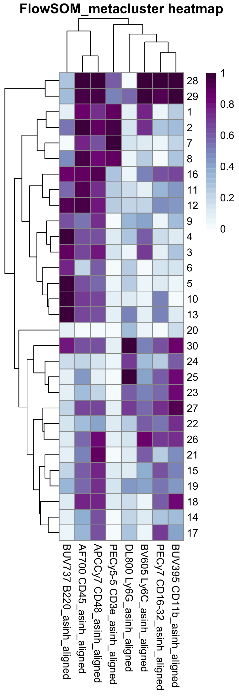

```{r setup, include=FALSE}
knitr::opts_chunk$set(echo = TRUE)
```

------------------------------------------------------------------------

[\<- Back to Spectre home page](https://immunedynamics.io/spectre)

<br /> <br />

## Introduction

------------------------------------------------------------------------

**Overview**

The batch alignment and analysis workflow builds on the 'simple
discovery' workflow by adding a step to facilitate batch alignment. This
workflow allows for the correction of technical variation or shifts in
signal levels in samples stained and/or acquired across multiple
batches. To do this, we have implemented the CytoNorm algorithm (Van
Gassen 2020). CytoNorm uses reference control samples that are prepared
and recorded along with each batch of samples to identify and correct
technical variations between individual batches, while preserving
biologically relevant differences. For more information on CytoNorm, see
Van Gassen et al 2020, and for more information on our implementation in
Spectre, see Ashhurst et al 2021.

The demo dataset used for this worked example are cells extracted from
mock- or virally-infected mouse bone marrow, measured by flow cytometry.
Expression level values in these datasets have been manipulated to
simulate acquisition over two batches.

**Reference controls for CytoNorm**

An example of reference control samples are aliquots of peripheral blood
mononuclear cells (PBMCs) that are derived from a single donor at one
time point, and cryopreserved (i.e. multiple aliquots of a biologically
identical sample). Each time a set of PBMC samples from the study cohort
are thawed, stained, and recorded, a reference controls is also thawed,
stained, and recorded. Differences in signal level between the reference
controls allows CytoNorm to learn the differences in signal levels due
to the batches, and correct them, while preserving biological
differences between the individual samples. In our demo dataset, we are
using bone marrow samples derived from separate mice. Though not derived
from the same mouse, these are similar enough that they can be used
successfully as reference controls.


**Correction of batch effects with CytoNorm**

Reference samples are clustered together using FlowSOM, where we attempt
to captures cells from matching populations in each batch in a single
metacluster (e.g. neutrophils from batch 1 and 2 are captured in
metacluster 1, etc). This assumes a reasonably low level of batch
effect, consisting of small shifts in the expression levels for one or
more markers. Because the proportion of cells in each population of the
reference samples are identical, FlowSOM can use quantile distributions
for each marker on each metacluser to create a model which will adjust
the data values, removing technical variation between batches. This
model is then applied to all samples in each batch.


**Requirements**

The reference controls can only correct batch effects for markers which
are actually expressed on the reference controls. For example, some
activation markers may be expressed on samples from the 'disease' group,
but won't be present on reference controls derived from healthy donors.
In this case, we would simply not attempt to perform alignment on that
marker. Typically, stable phenotyping markers (e.g. CD4, CD8) would be
expressed strongly enough in reference samples, and would be suitable
for alignment.

**Other approaches**

If you have samples derived from multiple batches, but do not have
reference controls processed with each batch, then other forms of batch
alignment might be possible -- see our data integration options for more
information.

<br />

## Citation and methods

------------------------------------------------------------------------

**Citation**

If you use Spectre in your work, please consider citing [Ashhurst TM,
Marsh-Wakefield F, Putri GH et al. (2022). Cytometry Part A 101 (3),
237-253](https://onlinelibrary.wiley.com/doi/full/10.1002/cyto.a.24350).
Please also consider citing the authors of the individual packages or
tools (e.g. CytoNorm, FlowSOM, tSNE, UMAP, etc) that are critical
elements of your analysis work.

**Sample methods blurb**

Here is a sample methods blurb for this workflow. You may need to adapt
this text to reflect any changes made in your analysis.

*Computational analysis of data was performed using the Spectre R
package (Ashhurst et al., 2022), with instructions and source code
provided at <https://github.com/ImmuneDynamics/spectre>. Samples were
initially prepared in FlowJo, and the population of interest was
exported as raw value CSV files. Arcsinh transformation was performed on
the data in R using a co-factor of 15 to redistribute the data on a
linear scale and compress low end values near zero. The dataset was then
merged into a single data.table, with keywords denoting the sample,
group, and other factors added to each row (cell). The CytoNorm
algorithm was used to correct for batch effects in the data using
matched reference samples processed in each batch. The FlowSOM algorithm
(Van Gassen et al., 2015) was then run on the merged dataset to cluster
the data, where every cell is assigned to a specific cluster and
metacluster. Subsequently, the data was downsampled and analysed by the
dimensionality reduction algorithm Uniform Manifold Approximation and
Projection (UMAP) (McInnes, Healy, Melville, 2018) for cellular
visualisation.*

<br />

## Setup

------------------------------------------------------------------------

#### Directories

Create a master folder with a meaningful name. Then inside that folder,
insert the following:

-   One folder called 'data' -- this will contain your data CSV or FCS
    files
-   One folder called 'metadata' -- this will contain a CSV containg
    your sample metadata
-   One folder called 'Spectre CytoNorm' or similar -- place this
    analysis script there

Example:

```         
  BM analysis
    /data
        -- Contains data files, one CSV or FCS per sample
    /metadata
        -- Contains a CSV containing sample metadata (group, batch, etc)
    /Spectre CytoNorm
        -- CytoNorm workflow.R
```

<br />

#### Analysis script

You can download the CytoNorm script from [this
link](https://github.com/ImmuneDynamics/Spectre/tree/master/workflows)
-- place this inside the `Spectre CytoNorm` folder.

<br />

#### Data files

If you would to use the **demo data** as a test run for the CytoNorm
workflow, nothing to do at this step. Simply follow the relevant
instructions further down this page to download the demo data (under [2.
Import and prep data](2.%20Import%20and%20prep%20data)).

If you would like to use your **own data**, add your data and metadata
files:

-   Place the sample CSV or FCS files in the `data` folder you created
    above.
-   Place the metadata CSV files in the `metadata` folder you created
    above.

Please see [this
page](https://unisyd-my.sharepoint.com/:b:/g/personal/thomas_ashhurst_sydney_edu_au/ES8T0wBKsapHo_q9mFuxsaoBjioEocJWPfetqLyfPEqmhQ?e=wsfclL)
for detailed instructions on exporting data for Spectre and setting up a
metadata file.

<br /> <br />

## 1. Packages and directories

------------------------------------------------------------------------

#### Load packages

Load the Spectre and other required libraries

Running library(Spectre) will load the Spectre package. We can then use
`package.check()` to see if the standard dependency packages are
installed, and `package.load()` to load those packages.

```{r, message = FALSE}
    ### Load libraries

        library(Spectre)
        Spectre::package.check()    # Check that all required packages are installed
        Spectre::package.load()     # Load required packages

    ### Install CytoNorm package
        
        if(!require('remotes')) {install.packages('remotes')}
        library('remotes')
        remotes::install_github(repo = "saeyslab/CytoNorm")
```

<br />

#### Set directories

Set 'PrimaryDirectory'

Initially, we will set the location of the script as `PrimaryDirectory`.
We'll use this as a sort of 'home page' for where our analysis is going
to be performed – including where to find our input data, metadata, and
where our output data will go.

```{r, message = FALSE, results = 'hide'}
    ### Set PrimaryDirectory
        
        dirname(rstudioapi::getActiveDocumentContext()$path)            # Finds the directory where this script is located
        setwd(dirname(rstudioapi::getActiveDocumentContext()$path))     # Sets the working directory to where the script is located
        getwd()
        PrimaryDirectory <- getwd()
        PrimaryDirectory
```

Set 'InputDirectory'

Next we need to set the location of the 'data' folder – where our
samples for analysis are stored. In this example they are stored in a
sub-folder called `data`.

```{r}
    ### Set 'input' directory
        
        setwd(PrimaryDirectory)
        dir.create('../data', showWarnings = FALSE)
        setwd("../data/")
        InputDirectory <- getwd()
        setwd(PrimaryDirectory)
```

Set 'MetaDirectory'

We need to set the location of the 'metadata' folder. This is where we
can store a CSV file that contains any relevant metadata that we want to
embed in our samples. In this example, it is located in a sub-folder
called `metadata.`

```{r}
    ### Set 'metadata' directory
        
        setwd(PrimaryDirectory)
        dir.create('../metadata', showWarnings = FALSE)
        setwd("../metadata/")
        MetaDirectory <- getwd()
        setwd(PrimaryDirectory)
```

Create 'OutputDirectory'

We need to create a folder where our output data can go once our
analysis is finished. In this example we will call this
`Output_Spectre`.

```{r}
    ### Create output directory
        
        setwd(PrimaryDirectory)
        dir.create("Output_Spectre", showWarnings = FALSE)
        setwd("Output_Spectre")
        OutputDirectory <- getwd()
        setwd(PrimaryDirectory)
```

<br /> <br />

## 2. Import and prep data

------------------------------------------------------------------------

#### Demo data

If you need the demo dataset, uncomment the following code in the
analysis script (select all, CMD+SHIFT+C) and run to download. **If you
are using your own datasets, then skip this step.**

This code will download the demo dataset files and metadata file, and
place them in the `data` and `metadata` folders respectively.

```{r, eval = FALSE, message = FALSE, results = 'hide'}
# setwd(PrimaryDirectory)
# setwd("../")
# getwd()
# download.file(url = "https://github.com/ImmuneDynamics/data/blob/main/simBatches.zip?raw=TRUE", destfile = 'simBatches.zip', mode = 'wb')
# unzip(zipfile = 'simBatches.zip')
# for(i in list.files('simBatches/data', full.names = TRUE)){
#   file.rename(from = i,  to = gsub('simBatches/', '', i))
# }
# for(i in list.files('simBatches/metadata', full.names = TRUE)){
#   file.rename(from = i,  to = gsub('simBatches/', '', i))
# }
# unlink(c('simBatches/', 'simBatches.zip', '__MACOSX'), recursive = TRUE)
```

```{r, eval = TRUE, echo = FALSE, message = FALSE, results = 'hide'}
setwd(PrimaryDirectory)
setwd("../")
getwd()
download.file(url = "https://github.com/ImmuneDynamics/data/blob/main/simBatches.zip?raw=TRUE", destfile = 'simBatches.zip', mode = 'wb')
unzip(zipfile = 'simBatches.zip')
for(i in list.files('simBatches/data', full.names = TRUE)){
  file.rename(from = i,  to = gsub('simBatches/', '', i))
}
for(i in list.files('simBatches/metadata', full.names = TRUE)){
 file.rename(from = i,  to = gsub('simBatches/', '', i))
}
unlink(c('simBatches/', 'simBatches.zip', '__MACOSX'), recursive = TRUE)
```

<br />

#### Import data

To begin, we will change our working directory to 'InputDirectory' and
list all the files in that directory – CSV files in this example.

```{r}
    ### Import data

        setwd(InputDirectory)
        list.files(InputDirectory, ".csv")
```

We can then read in all of our samples (in this example, one CSV file
per sample) into a list called `data.list.` Spectre uses the
`data.table` framework to store data, which reads, writes, and performs
operations on data very quickly.

```{r}
        data.list <- Spectre::read.files(file.loc = InputDirectory,
                                         file.type = ".csv",
                                         do.embed.file.names = TRUE)
```

Next we will review the data files by running the `do.list.summary()`
function.

<br />

#### Review data

```{r}
    ### Check the data

        check <- do.list.summary(data.list)

        check$name.table # Review column names and their subsequent values
        check$ncol.check # Review number of columns (features, markers) in each sample
        check$nrow.check # Review number of rows (cells) in each sample
```

You can review the first sample by running `data.list[[1]]`.

```{r}
        data.list[[1]]
```

#### Merge data

Merge data.tables

We can merge the data into a single data.table using do.merge.files().
By default, columns with matching names will be aligned in the new
table, and any columns that are present in some samples, but not others,
will be added and filled with 'NA' for any samples that didn't have that
column initially.

```{r}
    ### Merge data

        cell.dat <- Spectre::do.merge.files(dat = data.list)
        cell.dat
```

<br />

#### Read in metadata

Read in sample metadata.

```{r}
    ### Read in metadata  
       
        setwd(MetaDirectory)
        
        meta.dat <- fread("sample.details.csv")
        meta.dat
```

<br /> <br />

## 3. Data transformation

------------------------------------------------------------------------

Before we perform clustering etc, we need to meaningfully transform the
data. For more information on why this is necessary, please see [this
page]().

```{r}
    setwd(OutputDirectory)
    dir.create("Output 1 - transformed plots")
    setwd("Output 1 - transformed plots")
```

First, check the column names of the dataset.

```{r}
    ### Arcsinh transformation

        as.matrix(names(cell.dat))
```

In this example, the columns we want to apply arcsinh transformation to
are the cellular columns – column 1 to column 8. We can specify those
columns using the code below.

```{r}
        to.asinh <- names(cell.dat)[c(1:8)]
        to.asinh
```

Define the cofactor we will use for transformation. As a general
recommendation, we suggest using cofactor = 15 for CyTOF data, and
cofactor between 100 and 1000 for flow data (we suggest 500 as a
starting point). For more detailed guidance on setting the co-factors,
see [this page]().

```{r}
        cofactor <- 500
```

You can also choose a column to use for plotting the transformed result
– ideally something that is expressed on a variety of cell types in your
dataset.

```{r}
        plot.against <- "BV605 Ly6C_asinh"
```

Now we need to apply arcsinh transformation to the data in those
columns, using a specific co-factor.

```{r}
        cell.dat <- do.asinh(cell.dat, to.asinh, cofactor = cofactor)
```

We can then make some plots to see if the arcsinh transformation is
appropriate. Check the plots and see if you are happy with the
transformation. If happy, the proceed with analysis. Otherwise, go back
to the merging of the data.list (to create cell.dat) and try with
another co-factor.

```{r, eval=FALSE}
        transformed.cols <- paste0(to.asinh, "_asinh")

        for(i in transformed.cols){
          make.colour.plot(do.subsample(cell.dat, 20000), i, plot.against)
        }
```

<br /> <br />

## 4. Add metadata and set some preferences

------------------------------------------------------------------------

#### Add metadata

We also want to attach some sample metadata, to aid with our analysis.

```{r}
    ### Add metadata to data.table

        meta.dat
```

Here we will select just the columns we would like to add to our data.
In this example we only want to include use first four columns:
`Filename`, `Sample`, `Group`, and `Batch.` We will use `Filename` for
matching between `cell.dat` and `meta.dat`, and the other three columns
will be the information that gets added to `cell.dat`.

```{r}
        sample.info <- meta.dat[,c(1:4)]
        sample.info
```

Now we can add this information to `cell.dat`. Essentially, the file
names are listed in the metadata table, and we can use that to add any
listed metadata in the table to the corresponding files in data.list. We
can review the data to ensure the metadata has been correctly embedded.

```{r}
        cell.dat <- do.add.cols(cell.dat, "FileName", sample.info, "FileName", rmv.ext = TRUE)
        cell.dat
```

<br />

#### Setting preferences

Check the column names.

```{r}
    ### Define cellular columns

        as.matrix(names(cell.dat))
```

Specify columns that represent transformed cellular features (in this
case, the arcsinh transformed data, defined by "<columnname>\_asinh").
In this case, columns 11 to 18.

```{r}
        cellular.cols <- names(cell.dat)[c(11:18)]
        as.matrix(cellular.cols)
```

Additionally, specify the columns that will be used to generate cluster
and tSNE/UMAP results. Columns that are not specified here will still be
analysed, but won't contributed to the generation of clusters. There are
a couple of strategies to take here: use all cellular columns for
clustering to looks for all possible cell types/states, or use only
stably expressed markers to cluster stable phenotypes, which can then be
examined for changes in more dynamic markers. For more guidance, see
[this page]().

```{r}
    ### Define clustering columns    
        
        as.matrix(names(cell.dat))

        cluster.cols <- names(cell.dat)[c(11:18)]
        as.matrix(cluster.cols)
```

Here we can also specify sample, group, and batch columns.

```{r}
    ### Define other key columns
        
        as.matrix(names(cell.dat))

        exp.name <- "BM experiment"
        
        sample.col <- "Sample"
        group.col <- "Group"
        batch.col <- "Batch"
```

<br />

#### Set downsampling targets for visualisation

Additionally, we want to specify the downsample targets for
dimensionality reduction. This influences how many cells will be shown
on a tSNE/UMAP plot, and we are specifying the number of cells per group
to downsample to. Check for the number of cells (rows) in each group.

```{r}
    ### Subsample targets per group

        data.frame(table(cell.dat[[group.col]])) # Check number of cells per sample.
```

You can then specify the number to downsample to in each group. These
must be lower than the total number of cells in each group, and must be
provided in the order that the group names appear in the dataset when
running `as.matrix(unique(cell.dat[[group.col]]))`.

In this example we want 10000 cells from 'mock' and 10000 cells from
'Virus' so that we have balanced numbers visualised between each group.

```{r}
        as.matrix(unique(cell.dat[[group.col]]))
        
        sub.targets <- c(10000, 10000) # target subsample numbers from each group
        sub.targets
```

<br /> <br />

## 5. Batch alignment

------------------------------------------------------------------------

#### Setup

Here we need to setup some preferences for batch alignment.

```{r}
    ### Extract reference samples
        
        sample.info
```

In this case we need to select which samples will serve as our
'reference' samples. These should be individual aliquots from a single
biological samples that have been stain/processed in each batch (e.g.
cryopreserved PBMCs from a single blood collection event from a single
individual). In this example, we have selected one bone marrow sample
from a mock infected mice in each batch.

```{r}
        as.matrix(unique(cell.dat[[sample.col]]))
```

Here we are selecting the two samples: `Mock_01_A`, from batch A and
`Mock_05_B` from batch B, which will be our reference samples.

```{r}
        refs <- unique(cell.dat[[sample.col]])[c(1,5)]
        refs
```

Now we can create a new dataset (ref.dat) containing only cells from the
reference samples (in this example, `Mock_01_A` from batch A, and
`Mock_05_B` from batch B)

```{r}
        ref.dat <- do.filter(cell.dat, sample.col, refs)
        ref.dat
```

<br />

#### Initial clustering

First, we are going to align the data of only the two reference samples.

Setup a sub-directory for some pre-alignment plots.

```{r}
    ### Initial clustering
        
        setwd(OutputDirectory)
        dir.create("Output 2 - alignment")
        setwd("Output 2 - alignment")
```

Run `prep.cytonorm` to initialise a cytonorm object, including
clustering with FlowSOM. The number of metaclustes will be determined
automatically, or you can specify a desired number of metaclusters by
using the additional argument meta.k (e.g. `meta.k = 20`).

```{r}
        cytnrm <- prep.cytonorm(dat = ref.dat, 
                                cellular.cols = cellular.cols, 
                                cluster.cols = cluster.cols, 
                                batch.col = batch.col, 
                                sample.col = sample.col)
        
        cytnrm
```

Once this is complete, we can subsample the dataset and plot it using
UMAP.

```{r}
        cytnrm.sub <- do.subsample(cytnrm$dt, 10000)
        cytnrm.sub <- run.umap(cytnrm.sub, use.cols = cluster.cols)
```

Create a subfolder for plots.

```{r}
    ### Initial clustering plots
        
        setwd(OutputDirectory)
        setwd("Output 2 - alignment")
        dir.create("1 - ref pre-alignment")
        setwd("1 - ref pre-alignment")
```

First, we will colour the cells by which batch they originated from. We
can see batch effects evident by the offset between the red and green
cells. In this case they are coloured by 'File'.

```{r}
        make.colour.plot(cytnrm.sub, 'UMAP_X', 'UMAP_Y', 'File', 'factor')
```

Then, we need to examine the cellular expression across these cells.

```{r}
        make.multi.plot(cytnrm.sub, 'UMAP_X', 'UMAP_Y', cellular.cols)
```

Finally, we need to examine the metaclusters that have been generated,
and confirm that they capture matching populations across batches (e.g.
in this example, metacluster 1 captures B220+ B cells from both batches.
If too many or too few metaclusters are generated, you can try running
the prep.cytonorm function again, and specify a desired number of
metaclusters using the meta.k argument.

```{r}
        make.colour.plot(cytnrm.sub, 'UMAP_X', 'UMAP_Y', 'prep.fsom.metacluster', 'factor', add.label = TRUE)
```

You can see which file number corresponds to each batch by running
`cytnrm$files` and `cytnrm$file.nums`.

```{r}
        cytnrm$files
        cytnrm$file.nums
```

If the metaclusters are suitable, we will proceed to actually performing
alignment. Because the `train.cytonorm` and `run.cytonorm` functions
involve the writing and reading of files, we will set the directory
beforehand.

<br />

#### Full alignment

Set a directory for the outputs

```{r}
    ### Alignment
        
        setwd(OutputDirectory)
        dir.create("Output 2 - alignment")
        setwd("Output 2 - alignment")
```

Firstly, we need to train the model that will perform quantile alignment
for each marker on each metacluster.

```{r}
        cytnrm <- train.cytonorm(model = cytnrm, align.cols = cellular.cols)
```

Once complete, this model can be used to align the full dataset.

```{r}
        cell.dat <- run.cytonorm(dat = cell.dat, model = cytnrm, batch.col = batch.col)
```

<br />

#### Review alignment

To examine the results, we first need to specify the cellular names
containing the aligned data (they will have '\_aligned' appended to the
end).

```{r}
        aligned.cols <- paste0(cellular.cols, '_aligned')
```

Then we can set a new output directory.

```{r}
    ### Plotting reference data
        
        setwd(OutputDirectory)
        setwd("Output 2 - alignment")
        dir.create("2 - ref aligned")
        setwd("2 - ref aligned")
```

First, we will examine just the reference samples, to see if the
alignment looks suitable. We will run UMAP using the new aligned data.

```{r}
        ref.sub <- do.filter(cell.dat, sample.col, refs)
        ref.sub
        
        ref.sub <- do.subsample(ref.sub, 20000)
        ref.sub <- run.umap(ref.sub, use.cols = aligned.cols)
```

Plotting the data by batch reveals that the two batches are now well
integrated with eachother.

```{r}
        make.colour.plot(ref.sub, 'UMAP_X', 'UMAP_Y', batch.col, 'factor')
```

We can also plot the data by metacluster number, to confirm that they
look suitable (these are the metaclusters created when we made the
alignment model).

```{r}
        make.colour.plot(ref.sub, 'UMAP_X', 'UMAP_Y', 'Alignment_MC_aligned', 'factor', add.label = TRUE)
```

We can also colour the data by the exact samples (should be one per
batch).

```{r}
        make.colour.plot(ref.sub, 'UMAP_X', 'UMAP_Y', sample.col, 'factor')
```

As a sanity check, we can also check the experimental groups that these
cells come from. The reference samples should ideally all be from a
single experimental group, so if there are more than one group in the
plot below, there may be a problem with the setup.

```{r}
        make.colour.plot(ref.sub, 'UMAP_X', 'UMAP_Y', group.col, 'factor')
```

If the alignment looks suitable, we can then run UMAP and make plots
using a subset of the whole dataset.

```{r}
    ### Plotting all data
        
        setwd(OutputDirectory)
        setwd("Output 2 - alignment")
        dir.create("3 - all aligned")
        setwd("3 - all aligned")
        
        aligned.sub <- do.subsample(cell.dat, 50000)
        aligned.sub <- run.umap(aligned.sub, use.cols = aligned.cols)
```

Firstly, we can examine the distribution of cells from each batch.

```{r}
        make.colour.plot(aligned.sub, 'UMAP_X', 'UMAP_Y', batch.col, 'factor')
```

We can also check the metacluster assignments.

```{r}
        make.colour.plot(aligned.sub, 'UMAP_X', 'UMAP_Y', 'Alignment_MC_aligned', 'factor', add.label = TRUE)
```

We can then check the distribution of cells from each sample, and each
group. In this case the different distribution of cells in each
experimental group reflects biologicall relevant changes, and not batch
effects.

```{r}
        make.colour.plot(aligned.sub, 'UMAP_X', 'UMAP_Y', sample.col, 'factor')
```

```{r}
        make.colour.plot(aligned.sub, 'UMAP_X', 'UMAP_Y', group.col, 'factor')
```

For checking later, we can save a copy of the subsetted data to disk as
well.

```{r}
        fwrite(aligned.sub, 'aligned.sub.csv')
```

<br /> <br />

## 6. Clustering and dimensionality reduction

------------------------------------------------------------------------

Set a directory for outputs.

```{r}
    setwd(OutputDirectory)
    dir.create("Output 3 - clustering")
    setwd("Output 3 - clustering")
```

Adjust our saved column names so that we can perform clustering on the
new 'aligned' data.

```{r}
    ### Re-set cellular and clustering cols
    
        aligned.cellular.cols <- paste0(cellular.cols, '_aligned')
        aligned.cellular.cols
        
        aligned.cluster.cols <- paste0(cluster.cols, '_aligned')
        aligned.cluster.cols
```

We can run clustering using the run.flowsom function. In this case we
can define the number of desired metaclusters manually, with the meta.k
argument (in this case we have chosen 30). This can be increased or
decreased as required. Typically, overclustering is preferred, as
multiple clusters that represent a single cellular population can always
be annotated as such. Subsequently, we can write the clustered dataset
to disk.

```{r}
    ### Clustering

        cell.dat <- run.flowsom(cell.dat, aligned.cluster.cols, meta.k = 30) 
        fwrite(cell.dat, "clustered.data.csv")
```

We can then run dimensionality reduction on a subset of the data, allow
us to visualise the data and resulting clusters. In this case we have
used run.umap, though other options are available, including run.fitsne
and run.tsne. As before, this subsampled dataset with DR coordinates is
saved to disk.

```{r}
    ### Dimensionality reduction

        cell.sub <- do.subsample(cell.dat, sub.targets, group.col)
        cell.sub <- run.umap(cell.sub, aligned.cluster.cols)

        fwrite(cell.sub, "clustered.data.DR.csv")
```

We can visualise the DR data to asses which clusters represent cellular
populations

```{r}
    ### DR plots

        make.colour.plot(cell.sub, "UMAP_X", "UMAP_Y", "FlowSOM_metacluster", col.type = 'factor', add.label = TRUE)
        make.multi.plot(cell.sub, "UMAP_X", "UMAP_Y", aligned.cellular.cols)
```

We can also generate some multi plots to compare between experimental
groups or batches.

```{r}
        make.multi.plot(cell.sub, "UMAP_X", "UMAP_Y", "FlowSOM_metacluster", group.col, col.type = 'factor')
```

We can also produce expression heatmaps to help guide our interpretation
of cluster identities.

```{r, eval = FALSE}
    ### Expression heatmap

        exp <- do.aggregate(cell.dat, aligned.cellular.cols, by = "FlowSOM_metacluster")
        make.pheatmap(exp, "FlowSOM_metacluster", aligned.cellular.cols)
```



<br /> <br />

## 7. Annotate clusters

------------------------------------------------------------------------

Set an output directory.

```{r}
    setwd(OutputDirectory)
    dir.create("Output 4 - annotation")
    setwd("Output 4 - annotation")
```

Review the cluster labels and marker expression patterns, so you can
annotate the clusters. This annotation is optional, as all subsequent
steps can be performed on the 'clusters' instead of the 'populations'.
Here we can create a list of population names, and then specify which
clusters make up that population (e.g. Immature B cells are contained
within cluster '6').

```{r}
    ### Annotate

        annots <- list("Mature neutrophils" = c(24,25,23,27,30),
                       "Immature neutrophils" = c(22),
                       "Monocytes" = c(29,26),
                       "T cells" = c(2,1,8,7),
                       "Mature B cells" = c(3,4,9,5,10,13),
                       "Immature B cells" = c(6)
        )
```

Once the annotation list is created, we can switch the list into a table
format to annotate our data.

```{r}

        annots <- do.list.switch(annots)
        names(annots) <- c("Values", "Population")
        setorderv(annots, 'Values')
        annots
```

Using the do.add.cols function, we can add the population names to the
corresponding clusters.

```{r}
    ### Add annotations

        cell.dat <- do.add.cols(cell.dat, "FlowSOM_metacluster", annots, "Values")
        cell.dat
        
        cell.sub <- do.add.cols(cell.sub, "FlowSOM_metacluster", annots, "Values")
        cell.sub
```

Any unannotated clusters will then gain the label 'Other'.

```{r}
    ### Fill in NAs
        
        cell.dat[['Population']][is.na(cell.dat[, 'Population'])] <- 'Other'
        cell.dat
        
        cell.sub[['Population']][is.na(cell.sub[, 'Population'])] <- 'Other'
        cell.sub
```

Save data.

```{r, eval=FALSE}
    ### Save data and plots
        
        fwrite(cell.dat, "Annotated.data.csv")
        fwrite(cell.sub, "Annotated.data.DR.csv")
```

Subsequently, we can visualise the population labels on a UMAP plot.

```{r}
        make.colour.plot(cell.sub, "UMAP_X", "UMAP_Y", "Population", col.type = 'factor', add.label = TRUE)
        make.multi.plot(cell.sub, "UMAP_X", "UMAP_Y", "Population", group.col, col.type = 'factor')
```

We can also generate an expression heatmap to summarise the expression
levels of each marker on our populations.

```{r, eval=FALSE}
    ### Expression heatmap
        
        rm(exp)
        exp <- do.aggregate(cell.dat, aligned.cellular.cols, by = "Population")
        make.pheatmap(exp, "Population", aligned.cellular.cols)
```


Save FCS for further analysis and evaluation.

```{r, eval=FALSE}
    ### Write FCS files
        
        setwd(OutputDirectory)
        setwd("Output 4 - annotation")
        
        dir.create('FCS files')
        setwd('FCS files')
        
        write.files(cell.dat,
                    file.prefix = exp.name,
                    divide.by = sample.col,
                    write.csv = FALSE,
                    write.fcs = TRUE)
```

<br /> <br />

## 8. Summary data and statistical analysis

------------------------------------------------------------------------

Here we can create 'summary' data for our experiment. This involves
calculating the percentage of each population in each sample, along with
the corresponding cell counts if the information is available. In
addition, we calculate the MFI for selected markers on each population
in each sample.

First, set the working directory, and select which columns we will
measure the MFI of. In this case, CD11b_asinh and Ly6C_asinh.

Set output directory.

```{r}
    setwd(OutputDirectory)
    dir.create("Output 5 - summary data")
    setwd("Output 5 - summary data")
```

```{r}
    ### Setup
    
        variance.test <- 'kruskal.test'
        pairwise.test <- "wilcox.test"
    
        comparisons <- list(c("Mock", "Virus"))
        comparisons
        
        grp.order <- c("Mock", "Virus")
        grp.order
```

We can also specify which columns we wish to measure MFI levels on.

```{r}
    ### Select columns to measure MFI
    
        as.matrix(aligned.cellular.cols)
        dyn.cols <- aligned.cellular.cols[c(5,8)]
        dyn.cols
```

Use the new create.sumtable function to generate summary data – a
data.table of samples (rows) vs measurements (columns).

```{r}
    ### Create summary tables
    
        sum.dat <- create.sumtable(dat = cell.dat, 
                                   sample.col = sample.col,
                                   pop.col = "Population",
                                   use.cols = dyn.cols, 
                                   annot.cols = c(group.col, batch.col)
                                   )
```

Once the summary data has been generated, we can review it and select
which columns to plot. In each case, the column names (i.e. name of each
summary measure) are structured as 'MEASURE TYPE -- POPULATION'. This
provides a useful structure, as we can use regular expression searches
to split the name into just the MEASURE TYPE or POPULATION segment.

```{r}
    ### Review summary data
        
        sum.dat
        as.matrix(names(sum.dat))
```

Specify which columns we want to plot.

```{r}
        annot.cols <- c(group.col, batch.col)
        
        plot.cols <- names(sum.dat)[c(4:24)]
        plot.cols
```

Reorder the data such that sample appear in the specify group order.

```{r}
    ### Reorder summary data and SAVE
        
        sum.dat <- do.reorder(sum.dat, group.col, grp.order)
        sum.dat[,c(1:3)]
```

Save the summary data.

```{r}
        fwrite(sum.dat, 'sum.dat.csv')
```

### Violin/scatter plots

We can use the run.autograph function to create violin/scatter plots
with embedded statistic – one per population/measurement type.

```{r, eval = FALSE}
    ### Autographs

        for(i in plot.cols){
            
            measure <- gsub("\\ --.*", "", i)
            measure
            
            pop <- gsub("^[^--]*.-- ", "", i)
            pop
            
            make.autograph(sum.dat,
                           x.axis = group.col,
                           y.axis = i,
                           y.axis.label = measure, 
                           violin = FALSE, 
                           colour.by = batch.col,
                           
                           grp.order = grp.order,
                           my_comparisons = comparisons,
                           
                           Variance_test = variance.test,
                           Pairwise_test = pairwise.test,
                           
                           title = pop,
                           subtitle = measure,
                           filename = paste0(i, '.pdf'))
            
        }
```


### Heatmaps

We can also create a global heatmap show the z-score of each
population/measurement type against each sample.

```{r, eval=FALSE}
    ### Create a fold change heatmap
        
        ## Z-score calculation
        sum.dat.z <- do.zscore(sum.dat, plot.cols, replace = TRUE)
        
        ## Group 
        t.first <- match(grp.order, sum.dat.z[[group.col]])
        t.first <- t.first -1
        t.first
        
        ## Make heatmap
        make.pheatmap(sum.dat.z, 
                      sample.col = sample.col, 
                      plot.cols = plot.cols,
                      is.fold = TRUE, 
                      plot.title = 'Z-score',
                      annot.cols = annot.cols,
                      dendrograms = 'column',
                      row.sep = t.first,
                      cutree_cols = 3)
```


<br /> <br />

## 9. Output session info

------------------------------------------------------------------------

Create "Output-info" directory and save session data

For the final step of our setup, we want to record the session info our
R session, and save this in a folder we'll call "Output-info".

```{r}
    ### Session info and metadata
        
        setwd(OutputDirectory)
        dir.create("Output - info", showWarnings = FALSE)
        setwd("Output - info")

        sink(file = "session_info.txt", append=TRUE, split=FALSE, type = c("output", "message"))
        sessionInfo()
        sink()
```

We will also save the cellular and clustering columns.

```{r}
        write(aligned.cellular.cols, "cellular.cols.txt")
        write(aligned.cluster.cols, "cluster.cols.txt")
```

<br /> <br />
