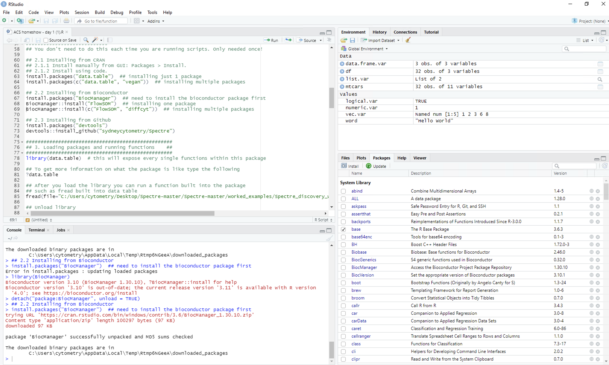
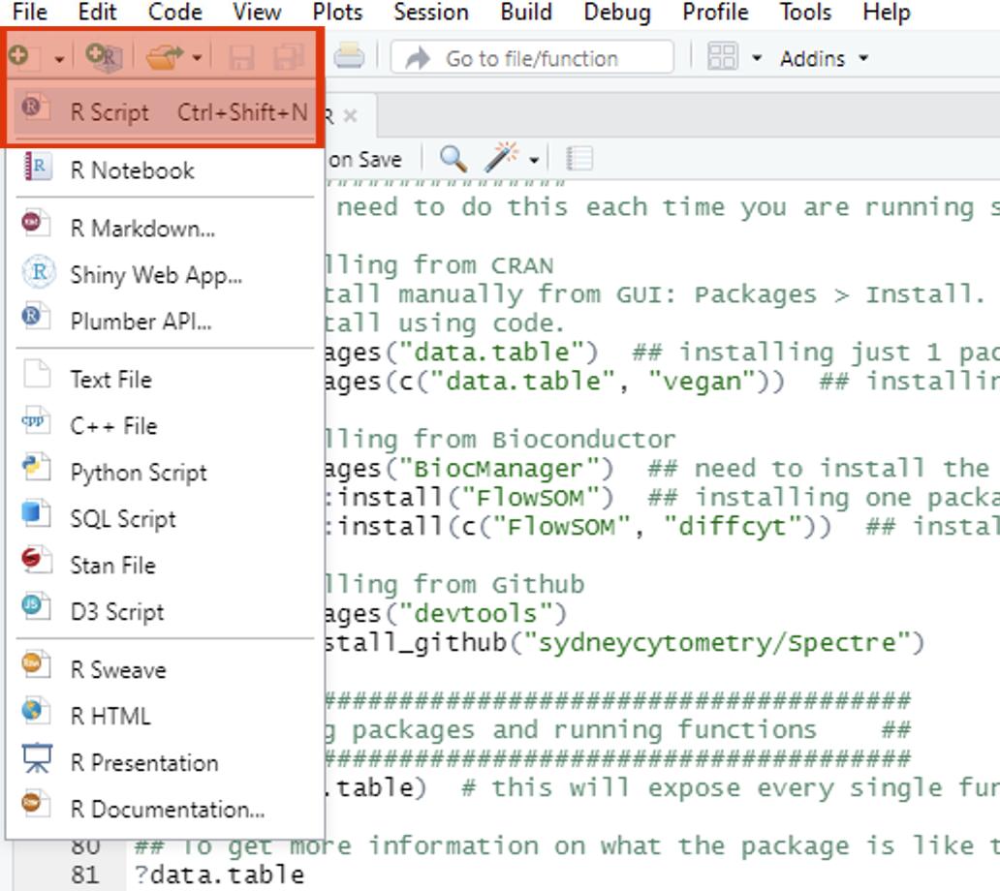
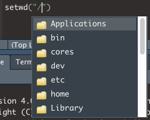
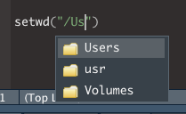
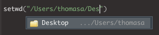
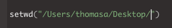
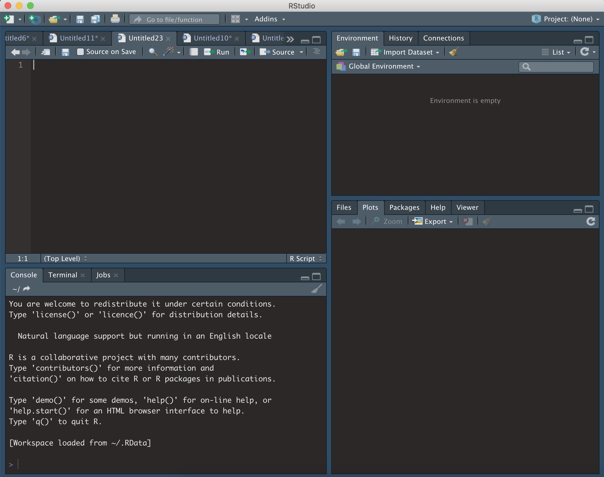
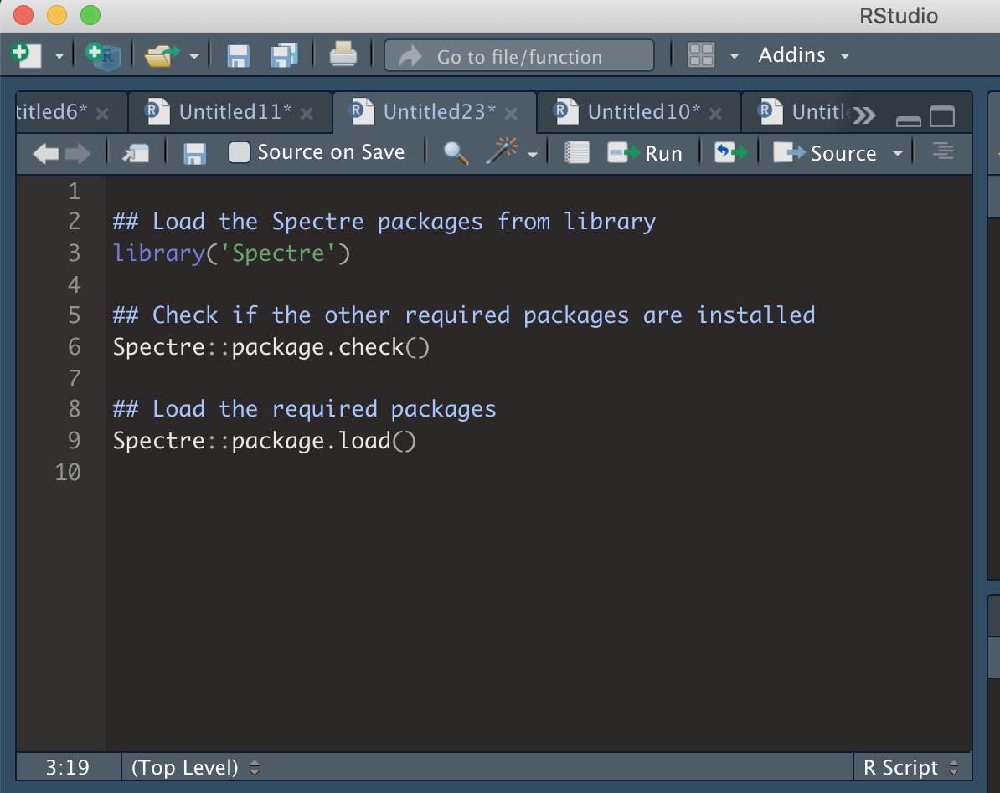
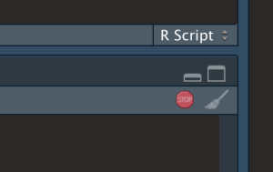

```{r setup, include=FALSE}
knitr::opts_chunk$set(echo = TRUE)
```

## Spectre basics guide

------------------------------------------------------------------------

Here provide a brief and high-level introduction to using R, RStudio,
and Spectre. Additional educational material on using R and R Studio are
available on many sites, including the [RStudio education
site](https://education.rstudio.com/) or this [R Spatial
page](https://rspatial.org/intr/index.html).

<br />

### R basics

To interact with the R programming language, we recommend using RStudio.

#### Open RStudio

Open RStudio, and you should see something similar to the following:

1.  Top left = R script. This is a text editor where lines or segments
    of code can be 'run', which will send commands to R.
2.  Bottom left = console. When commands are sent to R, the console will
    show the progress/output/result. Code can also be entered and run
    directly in the console.
3.  Top right = workspace. Whenever you create an object in R (such as
    saving a set of data) it will show up here.
4.  Bottom right = various. This is mainly used for displaying plots
    (under 'Plots'), investigating the packages ('Packages'), or using
    the help section ('Help').



<br />

#### R code basics

There are two important types of text commonly found in R scripts:

**Comments** Any line in R code that starts with a `#` is considered a
comment. These are not executed by RStudio as R code, but rather are
used as notes to the user.

This is a comment:

```{r, results = 'hide', message=FALSE, warning=FALSE, eval=FALSE, echo=TRUE}
## Run the following line to find your current working directory
```

**Executable code** A line or segment of code can be run and will return
some form of result. In the example below, the `getwd()` function will
return the location of the current working directory.

This is the code:

```{r, results = 'hide', message=FALSE, warning=FALSE, eval=FALSE, echo=TRUE}
getwd()
```

When the code is run, the output may look something like this:

```         
[1] "/Users/Tom/Desktop"
```

<br />

#### Create and save and R script

To get started, create a new .R file and save it

-   Make a folder on your desktop called "Spectre demo"
-   In RStudio, create a new R Script file (.R) called "MyScript" and
    save it in the folder you just created (Spectre demo).



<br />

#### Practice running code

For this demo we will use the 'iris' dataset, which consists of
measurements of 150 flowers. Each row represents one flower, and each
column represents a different measurement of that flower.

To run code in RStudio, we can either enter code into the script and
selectively run elements of the code (preferred), or we can enter it
directly into the console and run the code. For each of the code-blocks
below, copy the code into your new script, press save, and then
highlight and press CMD/CTRL return to execute the code

<br />

#### Read the dataset

Copy the following into your script, save, then highlight the code and
press CMD/CTRL return. The first command we will run is to load the
'iris' dataset and save it as the object 'dat'. The lines starting with
'\#' are only comments, and will not excute as commands (even if you
select them and press CMD + return).

```{r}
## Part 1: read the dataset
     
# Use the 'iris' dataset (150 flowers one per row) with various measurement (each column is a different measurement)
dat <- iris
```

After executing, you should should see a new object in the workspace
(top right). This will be called 'dat', containing 150 observations, and
5 variables.

```{r}
dat
```

Next we will review the dimensions of 'dat' (how many rows and columns)
and preview data from the first 6 rows of dat.

Copy the following into your script, save, then highlight the code and
press CMD/CTRL return. You should now see the following in the console.
Lines starting with '\>' denote the commands that were executed. Lines
without '\>' are the output. As you can see below the request to show
the dimensions of our dataset using dim(dat) has given us 150 rows and 5
columns.

```{r}
# Determine the number of rows and columns in the dataset
dim(dat)
```

Copy the following into your script, save, then highlight the code and
press CMD/CTRL return. You should now see the following in the console.
Lines starting with '\>' denote the commands that were executed. Lines
without '\>' are the output. The request to preview the first 6 rows of
our data using head(dat) has shown us the contents of the first 6 rows.

```{r}
# Examine the first few lines of dataset
head(dat)
```

<br />

#### Plot the dataset

Next, we will plot some of the dataset. Copy the following into your
script, save, then highlight the code and press CMD/CTRL return. After
executing, your should see the following under 'Plots'.

```{r}
## Part 2: plot the dataset
     
# Plot iris dataset (all plots)
plot(dat)
```

<br />

To be a little more specific, let's try plotting one column of the
dataset against another. Copy the following into your script, save, then
highlight the code and press CMD/CTRL return. Now we should see a plot
of the sepal width vs length.

```{r}
# Plot iris dataset (chosen X and Y parameters)
plot(x = dat$Sepal.Length, y = dat$Sepal.Width)
```

<br />

#### Save the dataset

Now, let's save the dataset as a .csv file. A .csv file is kind of like
an .xlsx file, without the bells and whistles. Data in a table format is
saved, using commas to indicate the separation of new columns. When this
is read by excel or RStudio, it displays a table. Run the following
lines to determine the current working directory (where you will read
files from and write files to).

Copy the following into your script, save, then highlight the code and
press CMD/CTRL return.

```{r, results = 'hide', message=FALSE, warning=FALSE, eval=FALSE, echo=TRUE}
## Part 3: save the dataset
 
# Determine the current working directory
getwd()      
```

This will return the location of your current working directory. In my
case:

```         
[1] "/Users/thomasa"
```

Let's aim to save the CSV to our desktop. To do this we would have to a)
change the 'working directory' to the desktop (on a mac, it would look
something like "/Users/Tom/Desktop"). When we set a working directory,
we are telling R a) where to look for files when we ask it to, and b)
where to create files when we ask it to.

To set the working directory, type setwd() into the script but don't run
it yet.

```{r, results = 'hide', message=FALSE, warning=FALSE, eval=FALSE, echo=TRUE}
setwd()
```

**Finding a specific directory (absolute path)**

-   On a mac, start by entering "/" between the (): setwd("/")
-   Click after the / and press TAB
-   You should see a list of options from your root directory. You can
    press the UP or DOWN arrows, or use the mouse cursor, to select on
    of the options, and press ENTER to select in.



-   If you start typing the name of a directory, the list of options
    will be filtered to options that match what you are typing.



-   In this case, I will select 'Users' and press ENTER. I can then
    repeat the process to navigate down my folders



-   You can repeat this process to find your working directory until you
    reach your desired location.



<br />

If I now select this line, or highlight the code and press ENTER, R will
set the working directory:

```{r, results = 'hide', message=FALSE, warning=FALSE, eval=FALSE, echo=TRUE}
setwd("/Users/thomasa/Desktop/")
```

The following should be returned

```         
> setwd("/Users/thomasa/Desktop/")
```

Now I can check the working directory has been set correctly by running
the following:

```{r, results = 'hide', message=FALSE, warning=FALSE, eval=FALSE, echo=TRUE}
getwd()
```

If everything has gone correctly, the following (or equivalent) should
be returned:

```         
[1] "/Users/thomasa/Desktop/"
```

Now we will write the dataset to a .csv file (which will be saved in the
working directory). We will use the function 'write.csv'. The input
variables here are what dataset we want to write (x = dat) and what we
want to call the file (file = "iris_dataset.csv").

Execute the following, and check the folder (set as your working
directory) to see that the new file has been created.

```{r, results = 'hide', message=FALSE, warning=FALSE, eval=FALSE, echo=TRUE}
# Write a .csv file of the dataset
write.csv(x = dat, file = "iris_dataset.csv")
```

<br /> <br />

### Spectre basics

------------------------------------------------------------------------

<br />

#### Setup tutorial script and dataset

To interact with the Spectre package in R, we will use RStudio.



<br />

#### Load Spectre package

To use Spectre, we first need to load the 'Spectre' package, as well as
other relevant packages. To do this, follow the instructions below.

-   Copy the code on the right into your R script (MyScript.R). Make
    sure to SAVE.
-   Run each line (one by one) by clicking on the line or highlighting
    the text, and press CMD + return (Mac) or CTRL + Enter (Windows).
-   As above, nothing is returned if they are loaded successfully, or an
    error message is returned if they are not.
-   If you have installed Spectre, but the package won't load, then you
    can visit our installation troubleshooting page.

```{r, results = 'hide', message=FALSE, warning=FALSE, eval=FALSE, echo=TRUE}
## Load the Spectre packages from library          
library('Spectre')
```

If successful:

```         
>
```

if unsuccessful:

```         
> Error in library("Spectre") : there is no package called ‘Spectre’
```

<br />

#### Load other packages

Rather than having to load each individual package required one-by-one
(library('plyr'), library('data.table') etc), we have created two
functions to simplify this process:

1.  `packages.check()` will check if all the required packages are
    installed
2.  `package.load()` will load all the required packages

```{r, results = 'hide', message=FALSE, warning=FALSE, eval=FALSE, echo=TRUE}
## Check if the other required packages are installed
Spectre::package.check()
## Load the required packages
Spectre::package.load()
```

As each package is loaded, you will see the following:

```         
> Loading required package: PACKAGENAME
```

So far you should have the following code in your script:



<br />

#### Set a working directory

Normally this would be the location of the files you would like to
analyse. For now, you can just this as your desktop or similar. If you
aren't sure how to search for directories, please have a look at our
basic R tutorial.

```{r, results = 'hide', message=FALSE, warning=FALSE, eval=FALSE, echo=TRUE}
## Set working directory       
setwd("/Users/thomasa/Desktop")
         
## Check that it has been set correctly
getwd()
 
## Save the working directory as an object called 'Primary Directory'
PrimaryDirectory <- getwd()
```

<br />

#### Create an output directory

Now we will create a directory where we can save the data and plots we
will generate shortly.

```{r, results = 'hide', message=FALSE, warning=FALSE, eval=FALSE, echo=TRUE}
## Create an output directory      
        dir.create("Spectre-demo-output")
 
## Go to that directory and save it as an object called 'Output Directory'
        setwd("Spectre-demo-output")
        getwd()    
        OutputDirectory <- getwd()
 
## Finally, set the current working directory to 'PrimaryDirectory'
        setwd(PrimaryDirectory)
```

```{r, echo=FALSE, eval = TRUE}
       OutputDirectory <- getwd()
       PrimaryDirectory <- getwd()
```

<br />

#### Load data

Normally, we load some CSV or FCS files from the disk, or a server into
R for analysis. In this tutorial, we will skip this step, and use an
included demo dataset called 'demo.start'. This is a dataset of 120,000
cells, from 12 bone marrow samples: 6x from mock-infected mice, and 6x
West Nile virus (WNV)-infected mice. This amounts to 10,000 cells per
sample. The data set is structured as a large data.frame (a table) where
each column is a cellular marker (e.g. FITC-CD4, etc), and each row is a
cell.

Assign the included demo.start dataset to a new object we will call
cell.dat.

```{r}
cell.dat <- Spectre::demo.clustered
cell.dat <- cell.dat[,1:19]
cell.dat <- Spectre::do.subsample(dat = cell.dat, targets = 10000)
```

You can review the structure of cell.dat by using str(). You can see the
cell.dat is both a 'data.table' and a 'data.frame'.

```{r}
str(cell.dat)
```

You can review the dimensionality of cell.dat by using dim(). The first
entry returned is the number of rows, and the second is the number of
columns.

```{r}
dim(cell.dat)
```

You can review the first 6 rows (out of the 10,000 rows) of cell.dat by
using head(). Each column is a marker or cellular feature, and each row
is a cell.

```         
head(cell.dat)
```

Now let's set some preferences.

```{r}
## Look at the names of the columns in the dataset, and take note of the number of each column
as.matrix(names(cell.dat))
```

Now we can choose the number of each column that we want to use for
clustering, rather than having to write out each column name. To do
this, we can put the number of the columns in a vector (i.e. c(5,6,8)
for columns 5, 6, and 8) within the function below. You can replace
these with the column numbers you would prefer to use (if you leave it
as c(5,6,8), then the columns used for clustering will be CD117,
CD16/32, and CD115.

```{r}
## Save the column names that you wish to use for clustering as an object called 'cluster.cols'.
cluster.cols <- names(cell.dat)[c(11:19)]
```

We can check to make sure the names have been saved by running
'cluster.cols'.

```{r}
as.matrix(cluster.cols)
```

<br />

#### Clustering

Now we can perform out clustering and dimensionality reduction. First we
are going to cluster the data using FlowSOM.

We can use the function 'run.flowsom' to run FlowSOM on our 'cell.dat'
dataset. For more information on performing clustering in Spectre, see
this page. There are two key arguments we need to provide to the
function. The first is 'dat', or the dataset to be used. The second is
'use.cols', which is the columns to be used for clustering. In this
case, we want to set dat to cell.dat, and use.cols to cluster.cols
(which we just created).

```{r, message=FALSE}
## Run FlowSOM
cell.dat <- Spectre::run.flowsom(dat = cell.dat, use.cols = cluster.cols) 
```

As the clustering is running, you will see the following red button show
up on your RStudio window. That means that RStudio is in the middle of
processing something, and it won't respond to other commands while it is
working.



<br />

While FlowSOM runs, you will progressively see the three following
updates:

```         
Creating SOM
Mapping data to SOM
Creating MST
```

Once FlowSOM has finished (and the red button has gone away) you can
check the data to ensure the FlowSOM columns have been added correctly.
At the end of what's returned, your should see the FlowSOM metaclusters
and clusters added to the dataset

```{r}
# Check cell.dat to ensure FlowSOM data correctly attached -- by looking at the last two columns
cell.dat
```

<br />

#### Run UMAP

Now we can perform dimensionality reduction on our data for
visualisation. For this we are going to use UMAP. For more information
on dimensionality reduction and cytometry data, please see this page.
There are two key arguments we need to provide to the function. The
first is 'dat', or the dataset to be used. The second is 'use.cols',
which is the columns to be used for clustering. In this case, we want to
set dat to cell.dat, and use.cols to cluster.cols (which we just
created). UMAP by default doesn't provide progress updates. It might
take 1-2 minutes for UMAP to finish running.

```{r}
## Run UMAP
cell.dat <- Spectre::run.umap(dat = cell.dat, use.cols = cluster.cols) 
```

Once UMAP has finished (and the red button has gone away) you can check
the data to ensure the UMAP columns have been added correctly.

```{r}
## Check cell.dat to ensure the two new UMAP columns have been correctly attached.
cell.dat
```

Now that we have run FlowSOM and UMAP, we want to do a quick visual
check to make sure everything looks correct. To do this we are going to
create a 'factor' plot – a dot plot with our two UMAP columns as the X
and Y axis, and the FlowSOM_metacluster as the colour. We are going to
add the labels of each cluster to the plot, and we will tell the
function not to save the image to disk. Running this command should
generate a plot in the viewer window in RStudio.

```{r, message = FALSE}
## Make a 'factor' plot
Spectre::make.colour.plot(dat = cell.dat,
                         x.axis = "UMAP_X",
                         y.axis = "UMAP_Y",
                         col.axis = "FlowSOM_metacluster",
                         col.type = 'factor',
                         add.label = TRUE,  
                         save.to.disk = FALSE)
```

<br />

#### Save data to disk

Now that we have added the cluster and UMAP information to our data, we
should save the files and capture our progress.

First, let's set our working directory to 'OutputDirectory', so the data
goes to the right place.

```{r}
## Set working directory to OutputDirectory
setwd(OutputDirectory)
getwd()
```

```{r, eval = FALSE}
## Save CSV files
Spectre::write.files(dat = cell.dat,
                     file.prefix = "Sample_CSV_file",
                     write.csv = TRUE,
                     write.fcs = FALSE)
```

To further explore this data in FlowJo, let's also save some FCS files.

```{r, eval = FALSE}
## Save FCS files
        Spectre::write.files(dat = cell.dat,
                             file.prefix = "Sample_FCS_file",
                             write.csv = FALSE,
                             write.fcs = TRUE)
```

<br />

#### Make some plots

Now we should create some informative plots.

First we will make another factor plot of the FlowSOM metaclusters, but
this time we will set 'save.to.disk' to TRUE. Once this has been run,
check your working directory for the image.

```{r, echo=TRUE, eval=FALSE}
## Make a 'factor' plot coloured by cluster
Spectre::make.colour.plot(dat = cell.dat,
                 x.axis = "UMAP_X",
                 y.axis = "UMAP_Y",
                 col.axis = "FlowSOM_metacluster",
                 col.type = 'factor',
                 add.label = TRUE)
```

```{r, echo=FALSE, eval=TRUE}
## Make a 'factor' plot coloured by cluster
Spectre::make.colour.plot(dat = cell.dat,
                 x.axis = "UMAP_X",
                 y.axis = "UMAP_Y",
                 col.axis = "FlowSOM_metacluster",
                 col.type = 'factor',
                 add.label = TRUE, 
                 save.to.disk = FALSE)
```

Next we'll make a colour plot showing the expression of a specific
marker

```{r, echo=FALSE}
## Make a colour plot for the expression level of CD11b
        Spectre::make.colour.plot(dat = cell.dat,
                         x.axis = "UMAP_X",
                         y.axis = "UMAP_Y",
                         col.axis = "CD11b_asinh",
                         add.label = TRUE,
                         save.to.disk = FALSE)
```

<br /> <br />

## Using Spectre

------------------------------------------------------------------------

When you are ready to start analysis, check out our structured workflows
and tutorials on the following pages:

-   Analysis of [high-dimensional
    cytometry](https://immunedynamics.github.io/spectre/cytometry) data
-   Analysis of [high-dimensional
    imaging/spatial](https://immunedynamics.github.io/spectre/spatial/)
    data
-   Analysis of [single-cell
    genomics](https://immunedynamics.github.io/spectre/single-cell/)
    data

<br /> <br />
