```{r setup, include=FALSE}
knitr::opts_chunk$set(echo = TRUE)
```

### Exporting data from FlowJo

This page explains the initial data analysis and preparation steps for
different forms of cytometry data, and how to export data from FlowJo in
preparation for analysis with Spectre. The overall objective is to
export a population of interest (e.g. leukocytes), usually following the
removal of doublets, debris, dead cells, and any irrelevant cells. 

**Population of interest (POI) gating**

Gate to your 'population of interest' (POI). Typically this will be
'live cells', or potentially live CD45+ cells (live leukocytes).

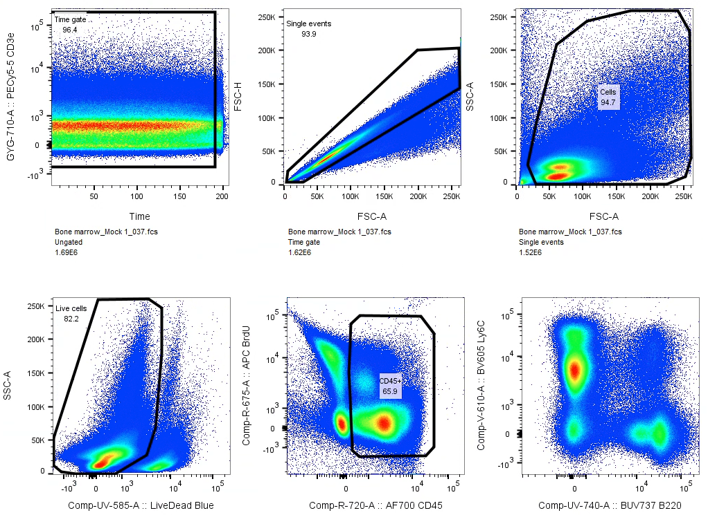

Select the POI you wish to export, and then click '**Select Equivalent
Nodes**' in the '**Edit**' space.

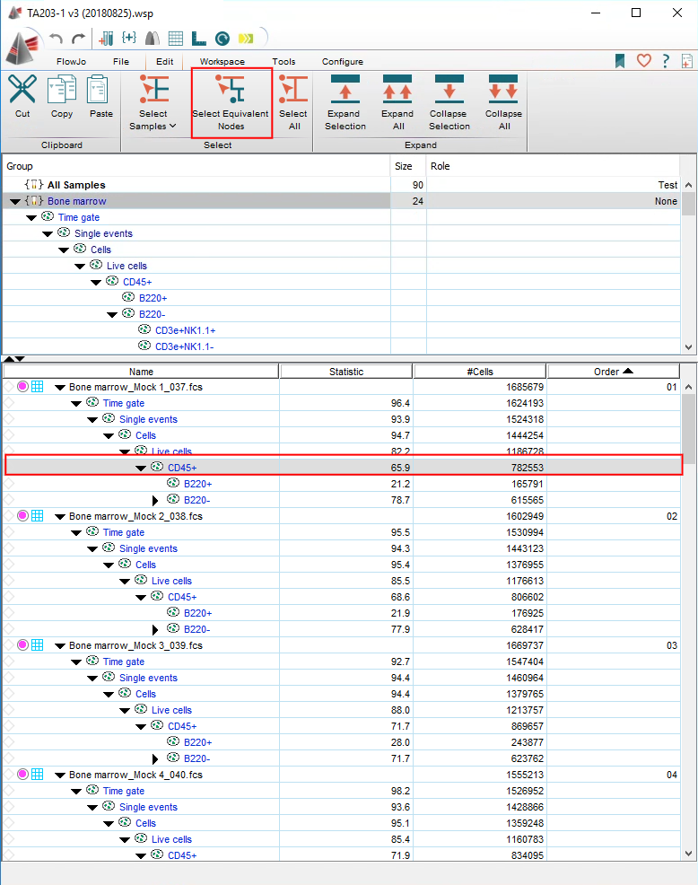 ... this will select each POI gates
in each samples.

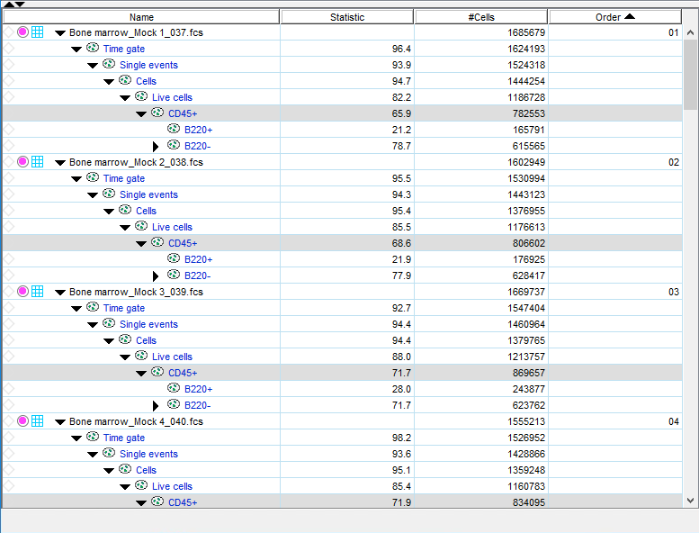

Right click on any of the POI populations (as long as all have been
selected) and select '**Export / Concatenate Populations'**

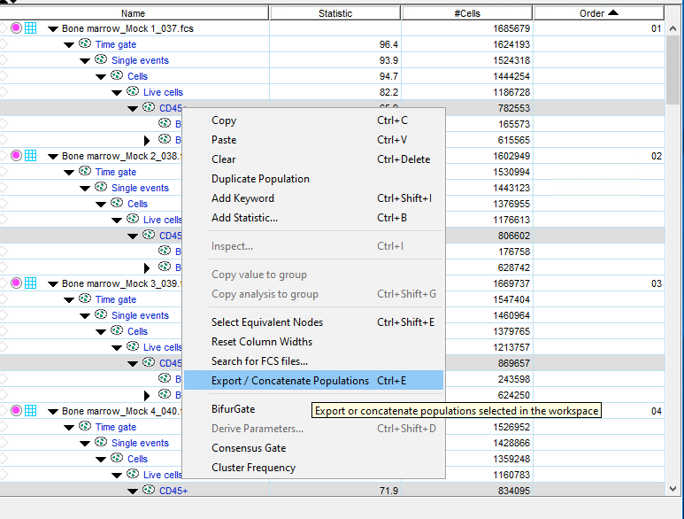

**Exporting data as an FCS or CSV file**

Spectre can import data as FCS or CSV files.

Choose a format for export:

-   By default we suggest exporting CSV (scale value) files

-   You can also export the data as FCS files

-   If you wish, you can export the 'channel values' as a CSV file
    instead. *The channel-values are pre-transformed, which removes the
    requirement for an arcsinh transformation in R. See [this
    page](https://immunedynamics.io/spectre/tutorials/data_transformation/data_transformation.html)
    for more information.*

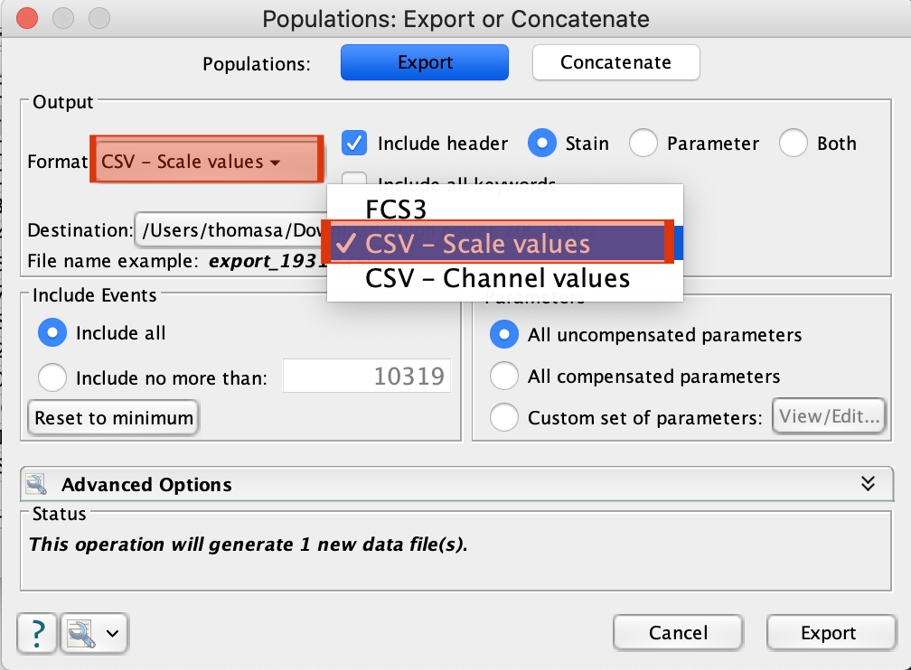

Under '**Parameters**', select '**Custom set of parameters**', and
select the parameters you wish to export. In this case, select FSC-A and
SSC-A, as well as the compensated (Comp-...) parameters.

Make sure to select the compensated ('Comp-...') parameters.

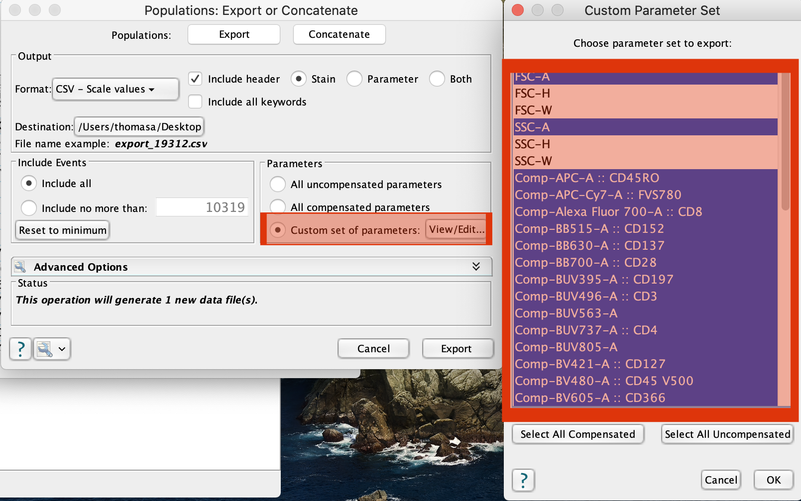

Choose a location for the export.

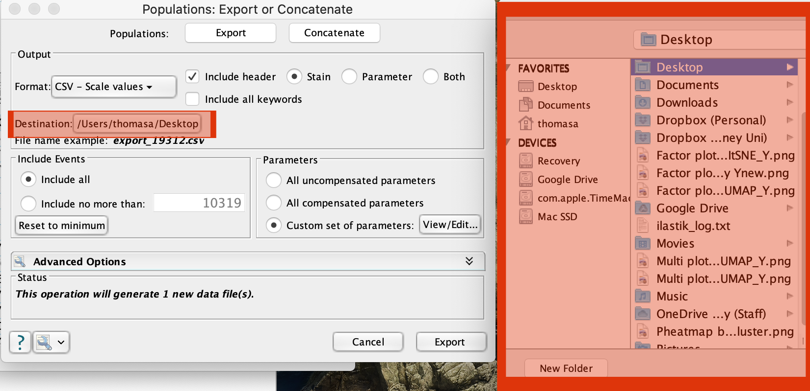

Result:

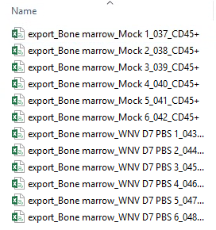

### Setup a sample metadata file

To make the analysis a little easier, we usually create a file that
contains relevant metadata for each file (e.g. sample name, group name,
batch, etc). This allows us to add that sample information to each cell
(row) in the data.table in R, making it easy to navigate, filter, and
plot the data by any factor (group, batch, etc). If you have cell count
for your files, this can be added here as well.

For most of our workflows, within the folder you are using for your
analysis there will be:

-   The R script

-   A 'data' folder, and

-   A 'metadata' folder

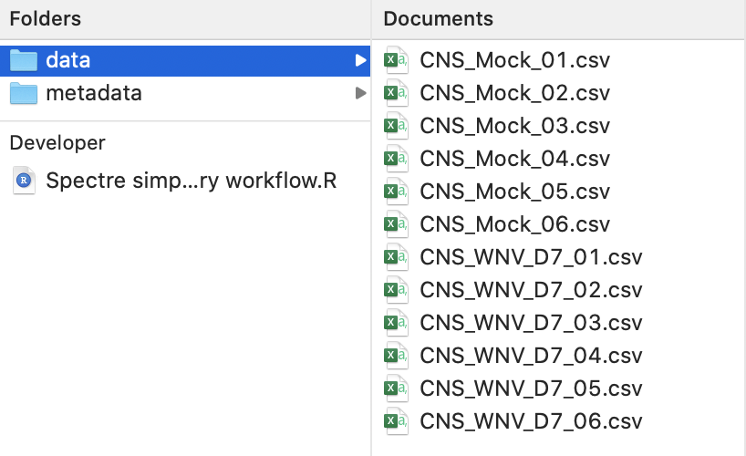

Using Microsoft Excel (or similar), create a new file and save it as a
CSV file in the metadata folder

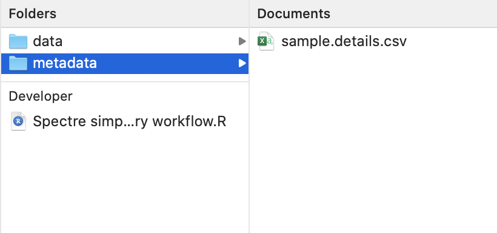

On a **Mac**, select the files, right click and select 'copy' (or press
CMD + C).

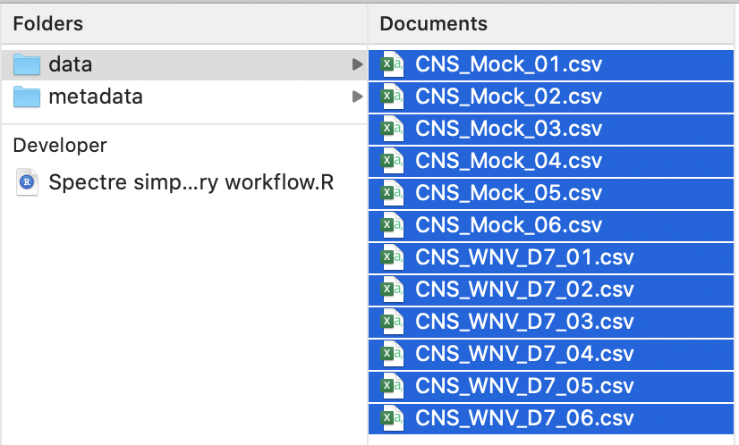

In the 'sample.details.csv' file, name the first column 'Filename' (A1),
then in A2 right click and select 'paste' (or press CMD + V). This will
paste the filenames into the CSV file.

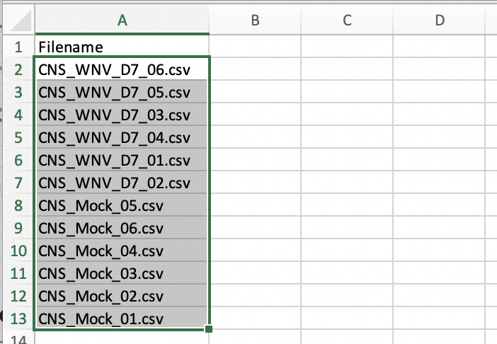

***On Windows**: select files, press CTRL + A, then paste into excel.
Use find and replace to remove the full file path (see [this
video](https://www.youtube.com/watch?v=F7SE5h7AUBg) for a
demonstration).*

You can then add as much information relevant to each file that you
like. Sample, Group, and Batch are 'required' for most of the Spectre
workflows (they aren't actually required, but it makes it easier to use
the default scripts). If all you samples are from one batch, just enter
'1' or 'A' (or some other batch name) into each row under 'batch'. If
you would like to add other information (time point, infection,
treatment, etc) then feel free to.

-   "Sample" is a recommended column, as this can be a more simplified
    name for each sample

-   "Group" is extremely useful for most analyses

-   "Batch" is helpful if you have prepared, stained, or run samples in
    multiple batches. If all you samples are from one batch, just enter
    '1' or 'A' (or some other batch name) into each row under 'batch'. 

-   "Cells per sample" is a useful column to add **if** you intend to
    generate absolute counts of each population per sample during the
    generation of summary data, but is not required otherwise.

-   If you would like to add other information (time point, infection,
    treatment, etc) then feel free to.

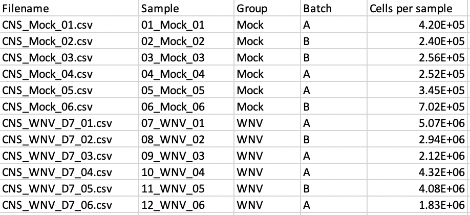

You are now ready to get started with Spectre. Check out our workflows
on the [Spectre Home page](https://immunedynamics.github.io/spectre).
The [Simple Discovery
Workflow](https://immunedynamics.io/spectre/simple-discovery/) is a
great place to get started.

<br /> <br />
