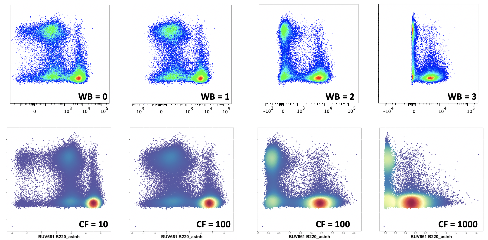

```{r setup, include=FALSE}
knitr::opts_chunk$set(echo = TRUE)
```

This page discusses various methods of axis or data transformation. For instructions to export these file types from FlowJo, please see this page.

## Axis scaling with cytometry data

***Excerpts on this page extracted from***: 
*Ashhurst, T. M.,Smith, A. L., &King, N. J. C.(2017).High‐dimensional fluorescence cytometry. Current Protocols in Immunology, 119, 5.8.1–5.8.38. doi: 10.1002/cpim.37*

An important consideration for analysis is how data is viewed and interpreted.
While fluorescence data was sometimes viewed on a linear scale, this was insufficient for simultaneously examining high and low fluorescence values.
Because of this, the use of a logarithmic scale for visualizing fluorescence cytometry data became typical.
However, viewing data on a typical logarithmic scale introduces misleading visual artifacts for signals at the low end of the scale.
As such, alternative methods of plotting data have been developed, such as using a bi-exponential scale with Logicle constraints (Parks, Roederer, & Moore, 2006).
In these Logicle transformations, the high end of the scale is logarithmic and the low end of the scale is converted into a linear scale.
The scale then returns to logarithmic at values below the linear component.


***Linear (max)***: The y- and x-axis have been plotted using a linear axis.
In cytometry data, this is often not so useful, as a large number of the data points are crowded in the left hand side of the plot, with much of the space taken up by high-value data points and potential outliers.

***Linear (modified max)***: If the linear plot is modified so that the maximum value is adjusted, the plot is slightly improved.
However, much of the data is still crowded in the left hand side of the plot, and a number of events are off scale on the right hand side.

***Logarithmic***: A logarithmic plot improves the visualisation, by enabling a greater dynamic range – both low and high value data points can be effectively plotted on the one continuum.
However, '0' and negative numbers cannot be plotted on a logarithmic scale, these are stacked on the left hand side.
Additionally, cells that are all 'negative' for the x-axis marker take up a large amount of the plot – this spread would be interpreted by a computational algorithm as relevant differences in expression.

***Logicle/Bi-exponential***: This plot is intended to be the best of both worlds.
Most of the plot is logarithmic, allowing for an effective dynamic range to be plotted.
The low end of the plot (left hand side) is compressed (reducing the spread of negative signal) and is switched briefly to linear around zero, allowing for the plotting of values of '0', and plotting of negative values below 0.

The degree to which the low-end logarithmic scale is ‘compressed’ into the linear space is known as the ‘width basis.’ This method of scaling allows data with low values, as well as data with negative values, to be displayed more accurately.
This approach is especially useful for visualizing data with high levels of SE, where the ‘negative’ or autofluorescent population spreads out substantially.


## Transforming data for computational analysis

In addition to transforming scales for visualizing cytometry data, the data itself can be transformed prior to analysis. 
One approach here is to use an [inverse hyperbolic arcsinh transformation](https://mathworld.wolfram.com/InverseHyperbolicSine.html).


Essentially, data that would most suitably be displayed on a Logicle scale is converted to a linear representation, and low-end values are compressed close to zero, depending on the cofactor (Fig.
5.8.12E,F).
This is often a necessary step prior to performing computational analysis on cytometry datasets.


The level of low-end compression here is determined by the co-factor used in arcsinh transformation.
Below we have a comparison of raw data (generated on an LSR-II) plotted on a Logicle/Bi-exponential scale (with various width basis 'WB' settings) compared against data transformed using arcsinh with various co-factors.



For mass cytometry data, a co-factor of 15 is suitable for most channels.
For flow cytometry data, this will vary from detector to detector (and machine to machine), but as a starting guide, a co-factor of 100 will yield similar compression results to the default scaling of LSR-II in FlowJo v10 (10^2 and below is compressed).

### How do I choose the correct ArcSinh co-factor?

What value you do you consider to be the upper limit of your background? 
Typically in CyTOF data this might be 10^1, whereas in flow data this might be 10^2 or 10^3. 
Using the figure below, we can see that to compress all values below 10^2, we would want to use a co-factor of approx. 
100 to 500, and to compress values below 10^3, we would want to use a co-factor of approx 1000 to 5000.


#### Examples: ArcSinh transformation of mass cytometry data

(A) Plots of raw data in FlowJo with various width basis (WB) settings for the x‐axis (168Er CD8a).
Minimum x‐axis value for each plot was adjusted to the highest possible value, within the restrictions imposed by FlowJo.
Y‐axis width basis was fixed at −100.
Both x‐ and y‐axis positive decades were set at 4.75.
(B) Plots of ArcSinh transformed data from R with various co‐factors used for the marker on the x‐axis.
Y‐axis co‐factor was fixed at 10.


### Examples: ArcSinh transformation of conventional and spectral cytometry data

Plots of data generated by a conventional (A–B) and spectral (C–D) flow cytometry system.
The conventional flow cytometry system was a 10‐laser BD LSR‐II, and the spectral flow cytometry system was a 5‐laser Cytek Aurora.
(A) Plots with of conventional flow cytometry raw data in FlowJo with various width basis (WB) settings for the x‐axis (BUV805 CD8a).
Minimum x‐axis value for each plot was adjusted to the highest possible value, within the restrictions imposed by FlowJo.
Y‐axis width basis was fixed at −100.
Both x‐ and y‐axis positive decades were set at 4.29.
(B) Plots of ArcSinh transformed data from R with various co‐factors used for the marker on the x‐axis.
Y‐axis co‐factor was fixed at 1000.
(C) Plots of spectral cytometry raw data in FlowJo with various width basis (WB) settings for the x‐axis (BUV805 CD8a).
Minimum x‐axis value for each plot was adjusted to the highest possible value, within the restrictions imposed by FlowJo.
Y‐axis width basis was fixed at −631.
Both x‐ and y‐axis positive decades were set at 5.68.
(D) Plots of ArcSinh transformed data from R with various co‐factors used for the marker on the x‐axis.
Y‐axis co‐factor was fixed at 5000.


### Alternative approach to data transformation: CSV channel values

A useful function available in FlowJo analysis software is the ability to export the data as a 
“CSV Channel Values”. 
In this case, the distribution of cells on a biaxial plot (usually with a bi-exponential or similar scale) 
is captured and given a linear scale between the values of 0 and 1024, through a process of “binning”. 
This allows the user to visually adjust the scale and low-end compression settings to a satisfactory point, 
rather than using a single cofactor for archsinh transformation.


The raw (scale) values will need to be transformed in R using an arcsinh transformation, whereas channel values can be used as-is.


Here are the file type options that can be exported from FlowJo:

| File Type                  | Description                                                                                                                                                             |
|----------------------------|-------------------------------------------------------------------------------------------------------------------------------------------------------------------------|
| FCS (.fcs)                 | Untransformed data exported in a default FCS (3.0) format. Following export, requires arcsinh transformation prior to clustering etc.                                   |
| CSV scale values (.csv)    | Untransformed data exported as a table in a CSV file – rows (cells) vs markers (columns). Following export, requires arcsinh transformation prior to clustering etc.    |
| CSV channel values (.csv)  | Transformed (see this page) data exported as a table in CSV file – rows (cells) vs markers (columns). Does not require arcsinh transformation.                         |

**To export 'channel values':**

Firstly, you will need to adjust the axis transformations in FlowJo to compress negative expression spread (if you are exporting FCS or CSV-scale values, this is not required).

Before:


After:


Choose **CSV - Channel values** during export.


