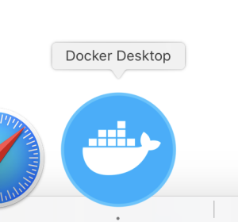
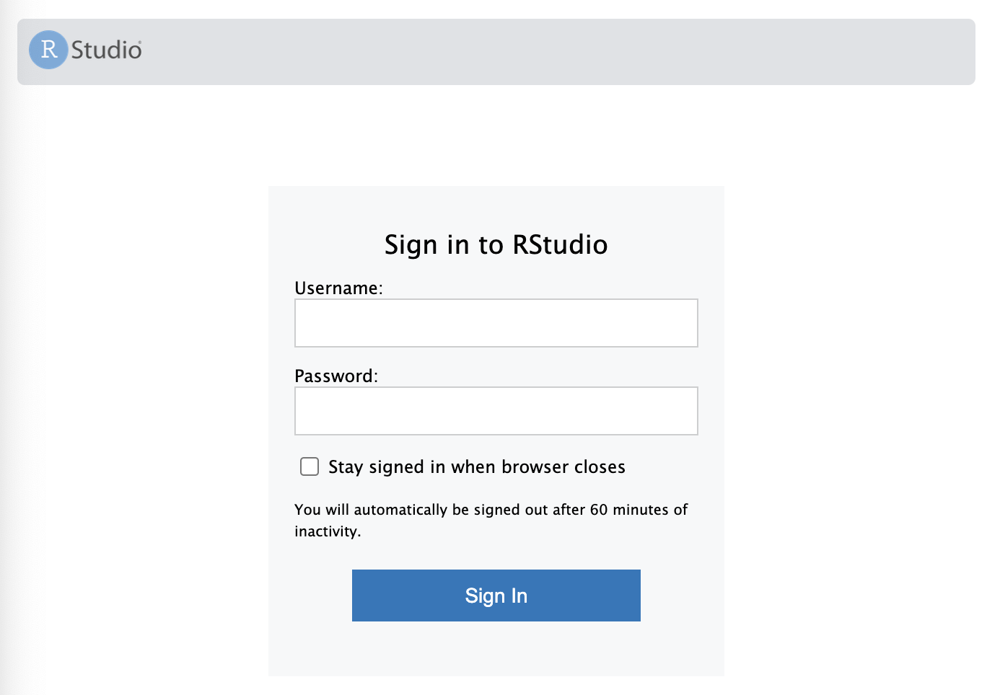
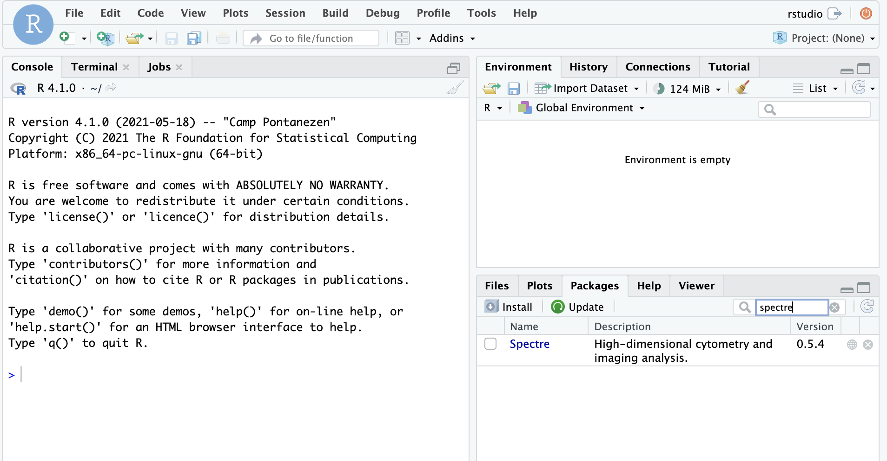

```{r setup, include=FALSE}
knitr::opts_chunk$set(echo = TRUE)
```

There two options for using Spectre:

-   [Install via RStudio]. Here you can download R and RStudio, and then
    install the Spectre package within this framework.
-   [Install via Docker]. Here you can download a Docker image that
    contains a pre-compiled installation of R, RStudio, the Spectre
    package, and other associated packages. This is a useful option for
    reproducible analysis.

***In Spectre v1.1 and above we have removed the package dependencies
`rgeos` and `rgdal` as these are no longer available on CRAN. The
package should install fine without these dependencies, but some spatial
functions may not work properly. If required, one can download the
archived packages, unzip them, and then placed them in the R library
location.***

<br />

### Install via RStudio

Download and install the **latest version** of [R (from
CRAN)](https://cran.r-project.org/) and [R
Studio](https://www.rstudio.com/products/rstudio/download/#download).

There are two ways to install Spectre, using `pak` or `remotes` package.
You can try installing using `pak` first, and if that does not work, you
can use the `remotes` package. Instructions for both are available
below.

***Important: If you are unfamiliar with running R code using Rstudio,
please visit our [Basics guide] section first.***

#### Using the pak package

Run the following R code to install Spectre using the
[pak](https://pak.r-lib.org/) R package.

```{r, results = 'hide', message=FALSE, warning=FALSE, eval=FALSE, echo=TRUE}
# Installs the package 'pak' if required
if (!requireNamespace("pak", quietly = TRUE)) {
    install.packages("pak")
}
# Install the Spectre package
pak::pkg_install("immunedynamics/Spectre")
```

When running the first command to install the `pak` package for the
first time, it might ask you to select which CRAN mirror to use. Pick
any mirror closest to where you are, enter the number, and press enter.

When running the second command, Pak will show a list of dependency
packages it has to install before it can install Spectre. The list may
look like the following:

```         
→ Will install 52 packages.
→ Will update 1 package.
→ Will download 49 CRAN packages (68.97 MB), cached: 4 (0 B).
+ ALL                             1.48.0    👷🏼‍♂️
+ car                             3.1-3      ⬇ (1.52 MB)
+ carData                         3.0-5      ⬇ (1.83 MB)
+ colorRamps                      2.3.4      ⬇ (28.21 kB)
+ ConsensusClusterPlus            1.70.0    
+ corrplot                        0.95       ⬇ (3.83 MB)
+ crosstalk                       1.2.1      ⬇ (407.91 kB)
+ dendextend                      1.19.0     ⬇ (5.06 MB)
+ dendsort                        0.3.4      ⬇ (1.17 MB)
+ Deriv                           4.2.0      ⬇ (153.06 kB)
+ doBy                            4.7.0      ⬇ (4.91 MB)
+ DT                              0.33       ⬇ (1.79 MB)
+ ellipse                         0.5.0      ⬇ (218.52 kB)
+ emmeans                         1.11.2     ⬇ (2.23 MB)
+ estimability                    1.5.1      ⬇ (49.22 kB)
+ FactoMineR                      2.11      🔧 ⬇ (3.82 MB)
+ flashClust                      1.01-2    🔧 ⬇ (25.21 kB)
+ FlowSOM                         2.14.0    
+ FNN                             1.1.4.1   🔧 ⬇ (130.43 kB)
+ ggforce                         0.5.0     🔧 ⬇ (2.67 MB)
+ ggnewscale                      0.5.2      ⬇ (355.68 kB)
+ ggpointdensity                  0.2.0     🔧 ⬇ (4.37 MB)
+ ggpubr                          0.6.1      ⬇ (2.13 MB)
+ ggrepel                         0.9.6     🔧 ⬇ (624.15 kB)
+ ggsci                           3.2.0      ⬇ (2.39 MB)
+ ggsignif                        0.6.4      ⬇ (603.29 kB)
+ ggthemes                        5.1.0      ⬇ (448.64 kB)
+ httpuv                          1.6.16    🔧 ⬇ (2.78 MB)
+ later                           1.4.2     🔧 ⬇ (786.21 kB)
+ lazyeval                        0.2.2     🔧 ⬇ (162.22 kB)
+ leaps                           3.2       🔧 ⬇ (104.19 kB)
+ MatrixModels                    0.5-4      ⬇ (409.70 kB)
+ microbenchmark                  1.5.0     🔧 ⬇ (72.58 kB)
+ modelr                          0.1.11     ⬇ (203.70 kB)
+ multcompView                    0.1-10     ⬇ (114.76 kB)
+ mvtnorm                         1.3-3     🔧 ⬇ (1.00 MB)
+ pbkrtest                        0.5.4      ⬇ (221.05 kB)
+ pheatmap                        1.0.13     ⬇ (78.22 kB)
+ polyclip                        1.10-7    🔧 ⬇ (440.78 kB)
+ polynom                         1.4-1      ⬇ (402.59 kB)
+ promises                        1.3.3     🔧 ⬇ (1.86 MB)
+ quantreg                        6.1       🔧 ⬇ (1.55 MB)
+ RcppAnnoy                       0.0.22    🔧 ⬇ (1.34 MB)
+ reshape2                        1.4.4     🔧 ⬇ (332.09 kB)
+ rstatix                         0.7.2      ⬇ (615.55 kB)
+ scattermore                     1.2       🔧 ⬇ (389.60 kB)
+ scatterplot3d                   0.3-44     ⬇ (348.86 kB)
+ SparseM                         1.84-2    🔧 ⬇ (942.60 kB)
+ Spectre              2.0.0-00 → 1.2.0     👷🏾‍♀️🔧 (GitHub: 9bcdb3b)
+ systemfonts                     1.2.3     🔧 ⬇ (7.23 MB)
+ tweenr                          2.0.3     🔧 ⬇ (974.49 kB)
+ uwot                            0.2.3     🔧 ⬇ (3.90 MB)
+ XML                             3.99-0.18 🔧 ⬇ (1.94 MB)

? Do you want to continue (Y/n)
```

To continue type letter `Y` and enter.

You should see a progress bar and messages showing the installation
progress. Wait until it finishes.

#### Using the remotes package

If you have trouble installing using the `pak` package above, you can
use `remotes` package to do the installation instead.

```{r, results = 'hide', message=FALSE, warning=FALSE, eval=FALSE, echo=TRUE}
# Installs the package 'remotes' if required
if (!requireNamespace("remotes", quietly = TRUE)) {
    install.packages("remotes")
}
# Install the Spectre package
remotes::install_github("immunedynamics/Spectre")
```

R might ask you to update some packages. In general we recommend
updating packages – to do this, enter 1. *However, you might wish to
delay this if you are in the middle of an analysis project.*


Some packages may have two different versions, *compiled* and *not
compiled*. Rstudio will ask whether you want to install the version that
require compilation.

If you want, then enter `Yes` so it will download the version that need
to be compiled, compile it, then install. *However this may require
extra softwares installed on your computer to run properly.*

It is ok to also enter `No` so it will install the version that has been
precompiled. This is often easier.

***However***, some packages must be compiled on your computer to run,
like so:


In this case, we recommend you specify `Yes` and let the computer do the
compiling.

If the installation was successful, you should see something similar to
the following:


#### Check that Spectre is installed

To check whether Spectre has been installed successfully, run the
following command:

```{r}
if (requireNamespace("Spectre", quietly = TRUE)) {
    message("Spectre is installed")
} else {
    message("Spectre is NOT installed")
}
```

If you get the message "Spectre is installed", then it has successfully
been installed.

<br /> <br />

### Install via Docker

Spectre is available as a Docker container, thanks to the efforts of Dr.
Givanna Putri. Docker is a cloud service that allows anyone to deliver
software packages as a "complete unit" in a form of container. What this
means is that the software package is released as a standalone computing
environment, pre-installed with necessary pre-requisite libraries
required by the software, and pre-configured for user convenience.
Spectre's Docker image will match the most recent versions of Spectre
(denoted as 'master', referring to the master branch in Github). To
download this version, simply follow the instructions below. If you wish
to load a specific version of Spectre, you can specify a version (e.g.
v0.5.3, v0.5.4. etc) instead of using 'master'. You can see a list of
versions available via docker on [this
page](https://hub.docker.com/r/immunedynamics/spectre/tags).

#### Download Docker app

Go to the following address:
<https://www.docker.com/products/docker-desktop>

Download the correct version of Docker Desktop.


Go to your downloads folder and open the '.dmg' file.


When the following window opens, drag and drop the 'Docker.app' icon
into the 'Applications' shortcut.


You should now be able to find 'Docker' in your applications folder.

<br />

#### Preferences (optional)

Open Docker app from the applications folder or bar at the bottom of the
screen.



Once you turn it on, you should see the following icon in the bar at the
top of the screen.


Additionally the program itself should open. Wait a few moments while
the 'Docker Engine' starts.


The icon in the lower left will turn green when ready.


Click the gears icon to open 'preferences'. Make sure you untick the
options in General to mimic the screenshot below. This is to ensure
Docker doesn't start when you boot your computer, and it doesn't share
your usage data to Docker by default. Leave the automatic update checked
if you prefer it to check for updates regularly.


Press 'Apply & Restart' when done. Close app until you would like to use
it.

<br />

#### Launching Docker

Open the Docker app.


Wait a few moments while the 'Docker Engine' starts.


The icon in the lower left will turn green when ready.


Open 'Terminal' (on Mac, can be found in the applications folder, or the
bar at the bottom of your screen).


Copy the following code into the terminal and press ENTER.

```         
docker run --rm -e PASSWORD=spectre -p 8787:8787 -v ~:/home/rstudio/spectre_dir --name=spectre immunedynamics/spectre:master
```


By default, the RStudio session that Docker will launch will be able to
see everything in your Home directory and below. This is achieved in the
code above using the '\~' symbol. If you have data elsewhere (on a
server etc) you can navigate to that location using Finger and drag +
drop the target directory/folder into terminal:

In terminal, add the following segments, and then hit ENTER:

1.  `docker run --rm -e PASSWORD=spectre -p 8787:8787 -v`
2.  DRAG+DROP the target folder from finder
3.  `:/home/rstudio/spectre_dir --name=spectre immunedynamics/spectre:master`

<br />

#### Initiate session

Open your preferred web browser (chrome, safari, etc) and go to the
following address

<http://localhost:8787>



Sign in

-   Name: `rstudio`
-   Password: `spectre`




#### Running Spectre

Open desired analysis script


Perform analysis


Close when finished


<br /> <br />

## Troubleshooting

------------------------------------------------------------------------

If Spectre or any of the dependencies was not installed successfully,
you may see some error messages like the following.


Alternatively, if Spectre was successfully installed, but when running
`package.check()` some of the dependencies were not been installed
correctly, you will see something like the following:

```         
Checking dependency packages...
 -- Biobase is required but not installed. Please install from BioConductor.
                
Check out 'https://immunedynamics.github.io/spectre/getting-started/' for help with installation
```

In this case, try install the offending packages independently. Note
whether the packages need to be installed from CRAN or Bioconductor.
Alternatively, you can [report an issue on
Github](https://github.com/ImmuneDynamics/Spectre/issues), ask for help
on our [discussion
board](https://github.com/ImmuneDynamics/Spectre/discussions), or [email
us](thomas.ashhurst@sydney.edu.au).

<br /> <br />
