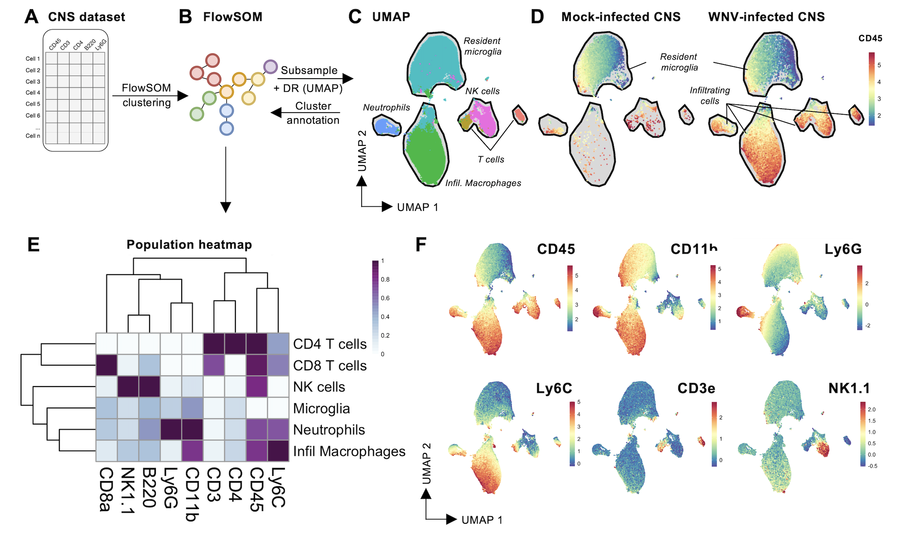
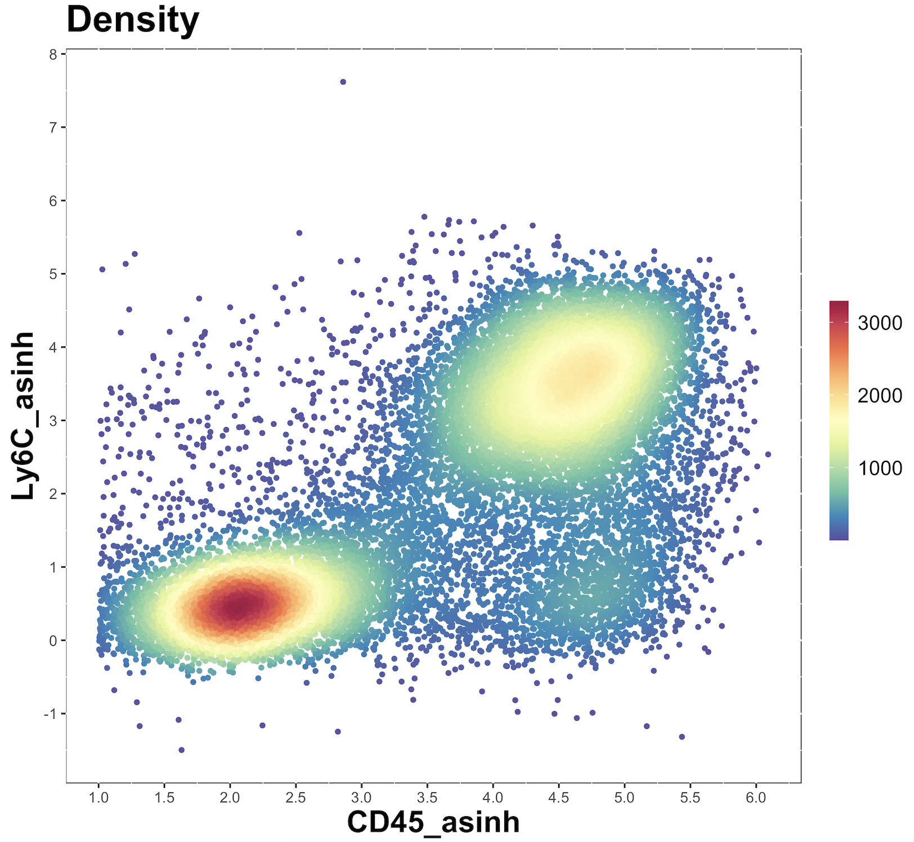
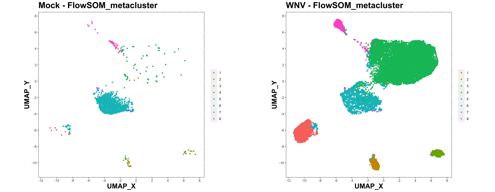
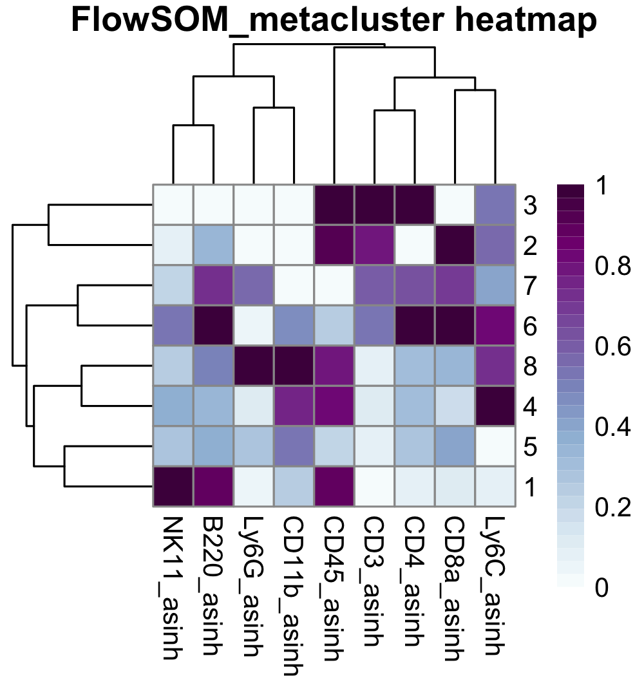
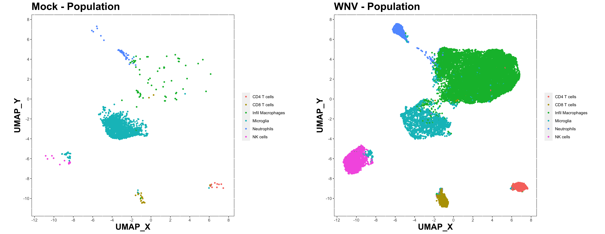
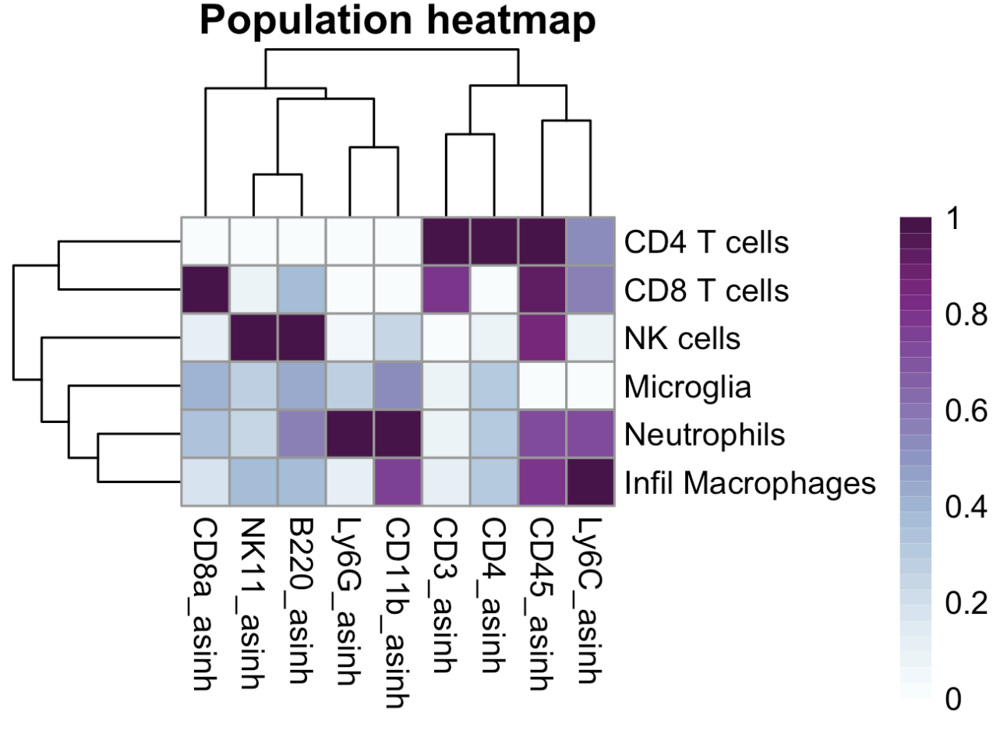
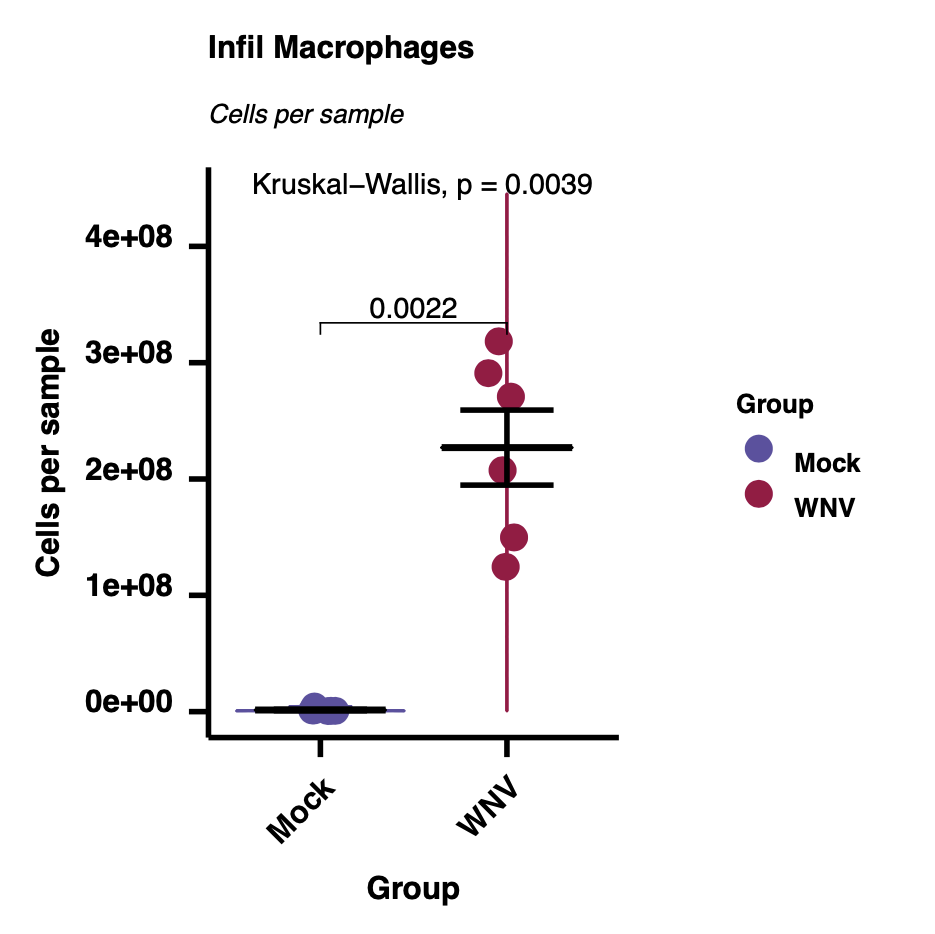
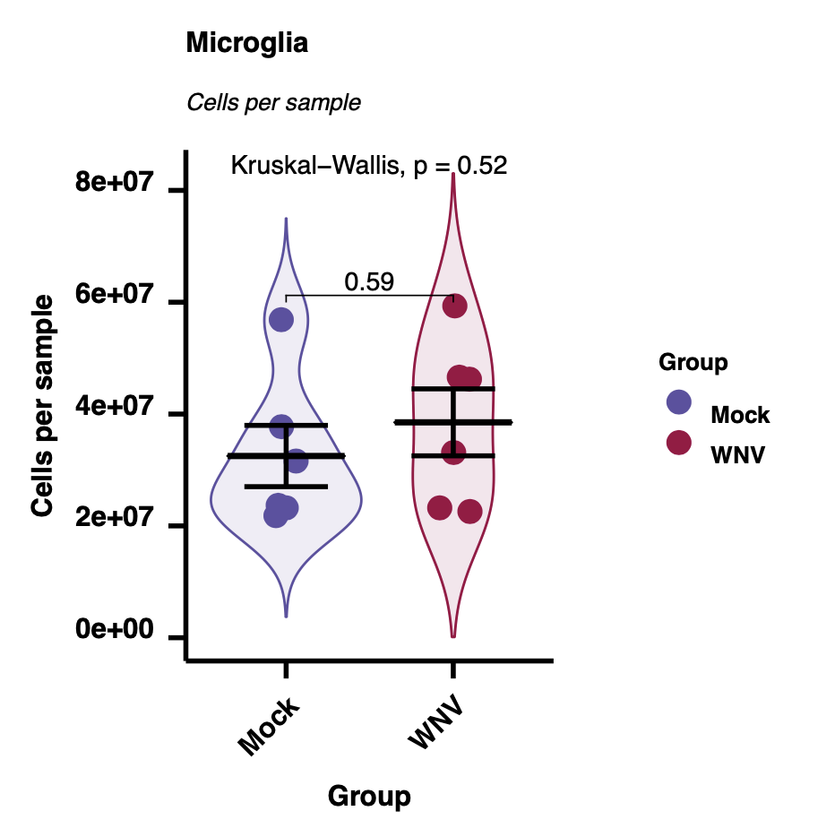
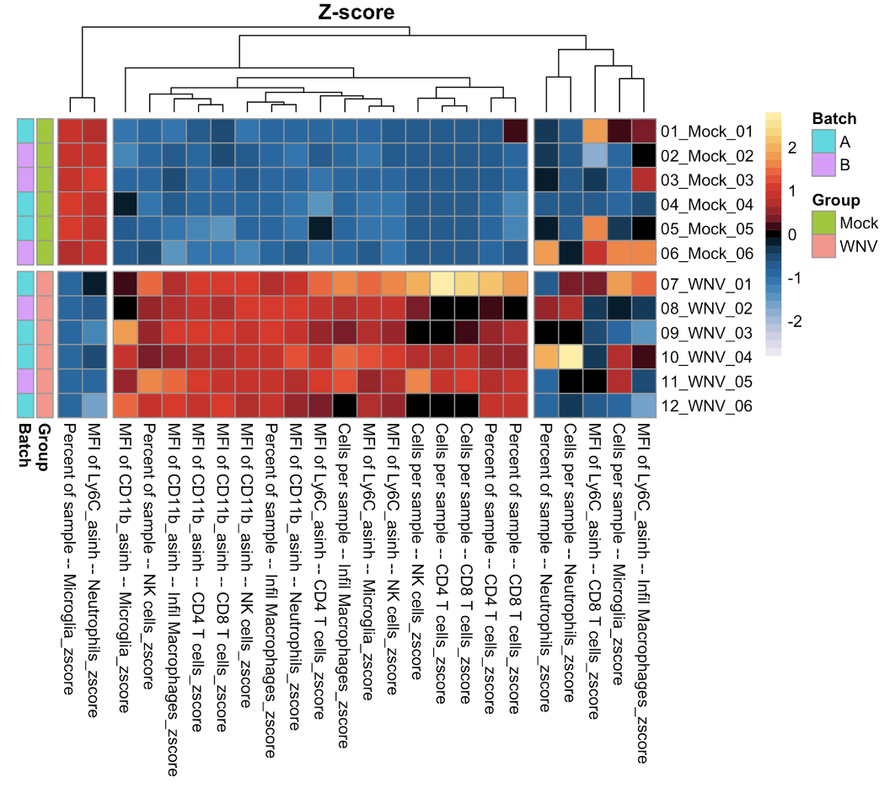

```{r, include = FALSE}
knitr::opts_chunk$set(
collapse = TRUE,
comment = "#>"
)
```


## Introduction

**Overview**

Here we provide a worked example of a 'simple' discovery analysis workflow, where the entire process 
(data prep, clustering, dimensionality reduction, cluster annotation, plotting, summary data, and statistical analysis) 
is contained within a single script. 
The 'simple' workflow is most suitable for fast analysis of small datasets. 
For larger or more complex datasets, or datasets with multiple batches, 
we recommend the general discovery workflow, where the data preparation, 
batch alignment, clustering/dimensionality reduction, and quantitative analysis are 
separated into separate scripts. 

The demo dataset used for this worked example are cells extracted from mock- or virally-infected mouse brains, 
measured by flow cytometry. 

**Strategy**

The 'simple' and 'general' discovery workflows are designed to facilitate the analysis of large and complex 
cytometry datasets using the Spectre R package. 
We've tested up to 30 million cells in a single analysis session so far. 
The workflow is designed to get around the cell number limitations of tSNE/UMAP. 
The analysis starts with clustering with FlowSOM – which is fast and scales well to large datasets. 
The clustered data is then downsampled, and dimensionality reduction is performed with tSNE/UMAP. 
This allows for visualisation of the data, and the clusters present in the dataset. 
Once the possible cell types in the datasets have been explored, the clusters can be labelled with the appropriate cellular identities. 
Finally, we can use the clusters/populations to generate summary statistics (expression levels, frequencies, total counts etc), 
which allows us to create graphs and heatmaps, facilitating statistical analysis.

**Multiple samples**

To analyse multiple samples, all the files must be imported into the one analysis session. 
This allows cells from each session to be clustered and analysed together, and allows us to examine the differential expression of markers, 
or the differences in cell proportions, between experimental groups.

**Batch alignment**

The 'simple' discovery workflow does not include any batch alignment steps. 
If batch correction needs to be applied, we recommend using the general discovery workflow.

{width=70%}

{width=70%}

## Before you start

If you haven't installed Spectre, please visit our 
[Spectre installation](https://immunedynamics.io/spectre/getting-started/) page. 
If you are new to R and Spectre, we recommend trying out the R/RStudio and 
Spectre [tutorials](https://immunedynamics.io/spectre/getting-started/) 
available on our [getting started](https://immunedynamics.io/spectre/getting-started/) page, 
to familiarise yourself with R/RStudio first.


## Citation and methods

**Citation**

If you use Spectre in your work, please consider citing 
[Ashhurst TM, Marsh-Wakefield F, Putri GH et al. (2022). Cytometry Part A 101 (3), 237-253](https://onlinelibrary.wiley.com/doi/full/10.1002/cyto.a.24350). 
To continue providing open-source tools such as Spectre, it helps us if we can demonstrate that our efforts are contributing to analysis efforts in the community. 
Please also consider citing the authors of the individual packages or tools (e.g. CytoNorm, FlowSOM, tSNE, UMAP, etc) that are critical elements of your analysis work. 
We have provided some generic text that you can use for your methods section with each protocol and on the 'about' page.

**Sample methods blurb**

Here is a sample methods blurb for this workflow. You may need to adapt this text to reflect any changes made in your analysis.

*Computational analysis of data was performed using the Spectre R package (Ashhurst et al., 2022), 
with instructions and source code provided at https://github.com/ImmuneDynamics/spectre. 
Samples were initially prepared in FlowJo, and the population of interest was exported as raw value CSV files. 
Arcsinh transformation was performed on the data in R using a co-factor of 15 to redistribute the data on a linear scale 
and compress low end values near zero. 
The dataset was then merged into a single data.table, with keywords denoting the sample, 
group, and other factors added to each row (cell). 
The FlowSOM algorithm (Van Gassen et al., 2015) was then run on the merged dataset to cluster the data, 
where every cell is assigned to a specific cluster and metacluster. Subsequently, the data was downsampled and 
analysed by the dimensionality reduction algorithm Uniform Manifold Approximation and Projection (UMAP) (McInnes, Healy, Melville, 2018) for cellular visualisation.*


## Setup

#### Directories

Create a master folder with a meaningful name. Then inside that folder, insert the following:

- One folder called 'data' -- this will contain your data CSV or FCS files
- One folder called 'metadata' -- this will contain a CSV containg your sample metadata
- One folder called 'Spectre simple discovery' or similar -- place this analysis script there

Example:
```{r eval=FALSE}
/spectre_simple_discovery  # Master folder for this simple discovery)}
  /data
    -- Contains data files, one CSV or FCS per sample
  /metadata
    -- Contains a CSV containing sample metadata (group, batch, etc)
  /scripts
    -- Spectre simple.discovery.R
```

#### Analysis script

You can download the **simple discovery** script from [this link](https://github.com/ImmuneDynamics/Spectre/tree/master/workflows).
Place this inside the `scripts` folder.

#### Data files

If you would to use the **demo data** as a test run for the simple discovery workflow, nothing to do at this step. 
Simply follow the relevant instructions further down this page to download the demo data.

If you would like to use your **own data**, add your data and metadata files:

- Place the sample CSV or FCS files in the `data` folder you created above.
- Place the metadata CSV files in the `metadata` folder you created above.

<!-- Please see [this page](http://immunedynamics.io/Spectre/) for detailed instructions on exporting data for Spectre and setting up a metadata file.  -->

## 1. Load packages and set directories

Running `library(Spectre)` will load the Spectre package (also known as a 'library'). 
We can then use `package.check()` to see if the standard dependency packages are installed, 
and `package.load()` to load those packages.

```{r, results = 'hide', message=FALSE, warning=FALSE}
### Load libraries

library(Spectre)
# Check that all required packages are installed
Spectre::package.check()
# Load required packages
Spectre::package.load()
```

Define a few directories to store data and results.

```{r}
PrimaryDirectory <- file.path(tempdir(), "spectre_simple_discovery") # For demo purposes, we use a temporary directory
# PrimaryDirectory <- "C:/Path/To/Your/Directory/spectre_simple_discovery" # Uncomment and edit this line to set your own directory
InputDirectory <- file.path(PrimaryDirectory, "data") # Directory containing data files
MetaDirectory <- file.path(PrimaryDirectory, "metadata") # Directory containing metadata files
OutputDirectory <- file.path(PrimaryDirectory, "output") # Directory to save results
```

Create them.

```{r}
dir.create(PrimaryDirectory, showWarnings = FALSE)
dir.create(InputDirectory, showWarnings = FALSE)
dir.create(MetaDirectory, showWarnings = FALSE)
dir.create(OutputDirectory, showWarnings = FALSE)
```

## 2. Import and prep data

### Demo data

If you need the demo dataset, run the following code in the analysis script (select all, CMD+SHIFT+C) and run to download. 
**If you are using your own datasets, then skip this step.** 
Alternative, download the files from [https://github.com/ImmuneDynamics/data/blob/main/msCNS.zip?raw=TRUE](https://github.com/ImmuneDynamics/data/blob/main/msCNS.zip?raw=TRUE).

This code will download the demo dataset files and metadata file, and place them in the `data` and `metadata` folders respectively.

```{r, message = FALSE, results = 'hide'}
download.file(
    url = "https://github.com/ImmuneDynamics/data/blob/main/msCNS.zip?raw=TRUE", 
    destfile = file.path(PrimaryDirectory, 'msCNS.zip'), 
    mode = 'wb'
  )
unzip(zipfile = file.path(PrimaryDirectory, 'msCNS.zip'), exdir = PrimaryDirectory)
for(i in list.files(file.path(PrimaryDirectory, 'msCNS', 'data'), full.names = TRUE)){
    file.rename(from = i,  to = file.path(InputDirectory, basename(i)) )
}
for(i in list.files(file.path(PrimaryDirectory, 'msCNS', 'metadata'), full.names = TRUE)){
    file.rename(from = i,  to = file.path(MetaDirectory, basename(i)) )
}
unlink(c(file.path(PrimaryDirectory, 'msCNS'), file.path(PrimaryDirectory, 'msCNS.zip')), recursive = TRUE)
```

### Import data

To begin, we will change our working directory to 'InputDirectory' and list all the CSV files in that directory – these should be the sample CSV files. We can then read in all of our samples (in this example, one CSV file per sample) into a list called 'data.list'. Spectre uses the data.table framework to store data, which reads, writes, and performs operations on data very quickly.

```{r, message=TRUE, warning=FALSE}
### Import data

list.files(InputDirectory, ".csv")

data.list <- Spectre::read.files(
    file.loc = InputDirectory,
    file.type = ".csv",
    do.embed.file.names = TRUE
)
```


By default, the `read.files()` function will generate some other variables, which you can review, by running the `do.list.summary()` function.

The `name.table` variable is a table of all the column names for all of your samples (one row per sample, one column per column name). 
If all of the column names are matching, then this table should be a repeating pattern. If it has been jumbled, then some of your samples have columns 
that don't appear in other samples. The `ncol.check` and `nrow.check` are simple tables indicating the number or columns and rows in each sample.

```{r, message=FALSE, warning=FALSE}
### Check the data

check <- do.list.summary(data.list)

check$name.table # Review column names and their subsequent values
check$ncol.check # Review number of columns (features, markers) in each sample
check$nrow.check # Review number of rows (cells) in each sample
```

You can review the first 6 rows of the first sample in your data using the following:

```{r, message=FALSE, warning=FALSE}
data.list[[1]]
```

### Merge data.tables

Once the metadata has been added, we can then merge the data into a single data.table using do.merge.files(). By default, columns with matching names will be aligned in the new table, and any columns that are present in some samples, but not others, will be added and filled with 'NA' for any samples that didn't have that column initially. Once the data has been merged, we can review the data:

```{r, message=FALSE, warning=FALSE}
### Merge data

cell.dat <- Spectre::do.merge.files(dat = data.list)
cell.dat
```

### Read in metadata

```{r, message=FALSE, warning=FALSE}
### Read in metadata  

meta.dat <- fread(file.path(MetaDirectory, "sample.details.csv"))
meta.dat
```

## 3. Data transformation

Before we perform clustering etc, we need to meaningfully transform the data. 
For more information on why this is necessary, please see [this page](https://immunedynamics.io/spectre/tutorials/data_transformation/data_transformation.html).

**Note**: 
*If you have imported CSV (channel value) files exported from FlowJo, then no data transformations are required, and you can skip all of the arcsinh transformation steps and proceed straight to adding the metadata. More information on the FCS, CSV scale, and CSV channel value file types can be found [here](https://immunedynamics.io/spectre/tutorials/data_transformation/data_transformation.html).*

Create an output directory to store the transformation plots.
```{r, message=FALSE, warning=FALSE}
plot.path <- file.path(OutputDirectory, "Output 1 - transformed plots")
dir.create(plot.path)
```

First, check the column names of the dataset.

```{r, message=FALSE, warning=FALSE}
as.matrix(names(cell.dat))
```

The columns we want to apply arcsinh transformation to are the cellular columns – column 1 to column 9. We can specify those columns using the code below.

```{r, message=FALSE, warning=FALSE}
### Arcsinh transformation

as.matrix(names(cell.dat))

to.asinh <- names(cell.dat)[c(1:9)]
to.asinh
```

Define the cofactor we will use for transformation. As a general recommendation, we suggest using cofactor = 15 for CyTOF data, and cofactor between 100 and 1000 for flow data (we suggest 500 as a starting point). Here is a quick comparison figure showing how different co-factors compare to bi-exponential transformations performed on an LSR-II. For more detailed information on this choice, and for approaches where different cofactors for different columns might be required, see [this page](https://wiki.centenary.org.au/x/w8yACQ). 

{width=70%}

<br />

In this worked example we will use a cofactor of 500.

```{r, message=FALSE, warning=FALSE}
cofactor <- 500
```

You can also choose a column to use for plotting the transformed result – ideally something that is expressed on a variety of cell types in your dataset. 

```{r, message=FALSE, warning=FALSE}
plot.against <- "Ly6C_asinh"
```

Now we need to apply arcsinh transformation to the data in those columns, using a specific co-factor. 

```{r, message=FALSE, warning=FALSE}
cell.dat <- do.asinh(cell.dat, to.asinh, cofactor = cofactor)
transformed.cols <- paste0(to.asinh, "_asinh")
```

We can then make some plots to see if the arcsinh transformation is appropriate

```{r, message=FALSE, fig.show='animate', warning=FALSE}
for(i in transformed.cols){
    make.colour.plot(do.subsample(cell.dat, 20000), i, plot.against, path = plot.path)
}
```

Check the plots and see if you are happy with the transformation. 
For more detailed guidance, see [this page](https://immunedynamics.io/spectre/tutorials/data_transformation/data_transformation.html). 
If happy, then proceed with analysis. 
Otherwise, go back to the merging of the data.list (to create cell.dat) and try with another co-factor.

{width=70%}

## 4. Add metadata

We also want to read in and attach some sample metadata, to aid with our analysis. 

```{r, message=FALSE, warning=FALSE}
### Add metadata to data.table

meta.dat
sample.info <- meta.dat[,c(1:4)]
sample.info
```

Once we have the metadata read into R, we will select only the columns we want to add to our dataset. In this example we only want to include use first four columns (Filename, Sample, Group, and Batch). 'Filename' will be used to for matching between cell.dat and meta.dat, and the other three columns will be the information that gets added to cell.dat

```{r, message=FALSE, warning=FALSE}
meta.dat
counts <- meta.dat[,c(2,5)]
counts
```

Now we can add this information to cell.dat. Essentially, the file names are listed in the metadata table, and we can use that to add any listed metadata in the table to the corresponding files in data.list. We can thrn review the data to ensure the metadata has been correctly embedded.

```{r, message=FALSE, warning=FALSE}
cell.dat <- do.add.cols(cell.dat, "FileName", sample.info, "Filename", rmv.ext = TRUE)
cell.dat
```

Check the column names and specify columns that represent cellular features (in this case, the arcsinh transformed data, defined by "markername_asinh").

```{r, message=FALSE, warning=FALSE}
### Columns

as.matrix(names(cell.dat))
cellular.cols <- names(cell.dat)[c(12:20)]
as.matrix(cellular.cols)
```

Additionally, specify the columns that will be used to generate cluster and tSNE/UMAP results. Columns that are not specified here will still be analysed, but won't contributed to the generation of clusters. There are a couple of strategies to take here: use all cellular columns for clustering to looks for all possible cell types/states, or use only stably expressed markers to cluster stable phenotypes, which can then be examined for changes in more dynamic markers. For more guidance, see our [tutorials page](https://immunedynamics.io/spectre/tutorials).

```{r, message=FALSE, warning=FALSE}
as.matrix(names(cell.dat))
cluster.cols <- names(cell.dat)[c(12:20)]
as.matrix(cluster.cols)
```

Specify sample, group, and batch columns.

```{r, message=FALSE, warning=FALSE}
exp.name <- "CNS experiment"
sample.col <- "Sample"
group.col <- "Group"
batch.col <- "Batch"
```

Additionally, we want to specify the downsample targets for dimensionality reduction. This influences how many cells will be shown on a tSNE/UMAP plot, and we are specifying the number of cells per group to downsample to. Check for the number of cells (rows) in each group:

```{r, message=FALSE, warning=FALSE}
### Subsample targets per group

data.frame(table(cell.dat[[group.col]])) # Check number of cells per sample.
```

You can then specify the number to downsample to in each group. These must be lower than the total number of cells in each group. In this example we want 2000 cells from 'mock' and 20,000 cells from 'WNV', to reflect the number of cells present in each group.

First, check the order that the groups appear in the dataset.

```{r, message=FALSE, warning=FALSE}
unique(cell.dat[[group.col]])
```

Now you can specify the targets (in the order of `unique(cell.dat[[group.col]])` above).

```{r, message=FALSE, warning=FALSE}
sub.targets <- c(2000, 20000) # target subsample numbers from each group
sub.targets
```

## 5. Clustering and Dimensionality reduction

Create an output directory to store the clustering and dimensionality reduction plots.

```{r, message=FALSE, warning=FALSE}
plot.path <- file.path(OutputDirectory, "Output 2 - clustering")
dir.create(plot.path)
```

We can run clustering using the run.flowsom function. In this case we can define the number of desired metaclusters manually, with the meta.k argument (in this case we have chosen 8). This can be increased or decreased as required. Typically, overclustering is preferred, as multiple clusters that represent a single cellular population can always be annotated as such. Subsequently, we can write the clustered dataset to disk.

```{r, message=FALSE}
### Clustering

cell.dat <- run.flowsom(cell.dat, cluster.cols, meta.k = 8)
cell.dat
```

We can then run dimensionality reduction on a subset of the data, allow us to visualise the data and resulting clusters. In this case we have used run.umap, though other options are available, including run.fitsne and run.tsne. As before, this subsampled dataset with DR coordinates is saved to disk.

```{r, message=FALSE, warning=FALSE}
### Dimensionality reduction

cell.sub <- do.subsample(cell.dat, sub.targets, group.col)
cell.sub

```

```{r, message=FALSE, warning=FALSE}

cell.sub <- run.umap(cell.sub, cluster.cols)
cell.sub
```

We can visualise the DR data to asses which clusters represent cellular populations.

```{r, message=FALSE, fig.height=7, fig.width=7, warning=FALSE}
### DR plots

make.colour.plot(
    cell.sub, 
    "UMAP_X", 
    "UMAP_Y", 
    "FlowSOM_metacluster", 
    col.type = 'factor', 
    add.label = TRUE,
    path = plot.path,
)
```

```{r, fig.show='hide', message=FALSE, fig.height=7, warning=FALSE}
make.multi.plot(cell.sub, "UMAP_X", "UMAP_Y", cellular.cols, path = plot.path)
```

{width=70%}

We can also generate some multi plots to compare between experimental groups or batches.

```{r, fig.show='hide', message=FALSE, message=FALSE, fig.height=7, warning=FALSE}
make.multi.plot(
    cell.sub, "UMAP_X", "UMAP_Y", "FlowSOM_metacluster", 
    group.col, col.type = 'factor', path = plot.path
)
```

{width=70%}

We can also produce expression heatmaps to help guide our interpretation of cluster identities.

```{r, message=FALSE, warning=FALSE}
### Expression heatmap

exp <- do.aggregate(cell.dat, cellular.cols, by = "FlowSOM_metacluster")
make.pheatmap(exp, "FlowSOM_metacluster", cellular.cols, path = plot.path)
```

{width=50%}

## 6. Annotate clusters

Review the cluster labels and marker expression patterns, so you can annotate the clusters. This annotation is optional, as all subsequent steps can be performed on the 'clusters' instead of the 'populations'. Here we can create a list of population names, and then specify which clusters make up that population (e.g. CD4 T cells are contained within cluster '3').

```{r, message=FALSE, warning=FALSE}
plot.path <- file.path(OutputDirectory, "Output 3 - annotation")
dir.create(plot.path)
```

```{r, message=FALSE, warning=FALSE}

### Annotate

annots <- list("CD4 T cells" = c(3),
                "CD8 T cells" = c(2),
                "NK cells" = c(1),
                "Neutrophils" = c(8),
                "Infil Macrophages" = c(4),
                "Microglia" = c(5,6,7)
)
```

Once the annotation list is created, we can switch the list into a table format to annotate our data.

```{r, message=FALSE, warning=FALSE}
annots <- do.list.switch(annots)
names(annots) <- c("Values", "Population")
setorderv(annots, 'Values')
annots
```

Using the do.add.cols function, we can add the population names to the corresponding clusters.

```{r, message=FALSE, warning=FALSE}

### Add annotations

cell.dat <- do.add.cols(cell.dat, "FlowSOM_metacluster", annots, "Values")
cell.dat

cell.sub <- do.add.cols(cell.sub, "FlowSOM_metacluster", annots, "Values")
cell.sub
```


Subsequently, we can visualise the population labels on a UMAP plot.

```{r, message=FALSE, warning=FALSE, fig.width=7, fig.height=7}
make.colour.plot(cell.sub, "UMAP_X", "UMAP_Y", "Population", col.type = 'factor', add.label = TRUE, path = plot.path)
```

```{r, message=FALSE, warning=FALSE, fig.show='hide'}
make.multi.plot(cell.sub, "UMAP_X", "UMAP_Y", "Population", group.col, col.type = 'factor', path = plot.path)
```

{width=70%}

We can also generate an expression heatmap to summarise the expression levels of each marker on our populations.

```{r, message=FALSE, warning=FALSE}

### Expression heatmap

rm(exp)
exp <- do.aggregate(cell.dat, cellular.cols, by = "Population")
make.pheatmap(exp, "Population", cellular.cols, path = plot.path)

```

{width=50%}

Save the annotated data to disk, both the full dataset (cell.dat) and the downsampled dataset (cell.sub).

```{r, message=FALSE, warning=FALSE}
### Write data
outdir <- file.path(OutputDirectory, "Output 3 - annotation")
dir.create(outdir, showWarnings = FALSE)

fwrite(cell.dat, file.path(outdir, "Annotated.data.csv"))
fwrite(cell.sub, file.path(outdir, "Annotated.data.DR.csv"))
```

Save data as FCS files for use in FlowJo or other software.

```{r, message=FALSE, warning=FALSE}
### Write FCS files

outdir <- file.path(OutputDirectory, "Output 3 - annotation", "FCS files - all")
dir.create(outdir, showWarnings = FALSE)

write.files(cell.dat,
            file.prefix = file.path(outdir, exp.name),
            divide.by = sample.col,
            write.csv = FALSE,
            write.fcs = TRUE)
```

```{r, message=FALSE, warning=FALSE}
outdir <- file.path(OutputDirectory, "Output 3 - annotation", "FCS files - DR")
dir.create(outdir, showWarnings = FALSE)

write.files(cell.sub,
            file.prefix = file.path(outdir, paste0('DR-', exp.name)),
            divide.by = sample.col,
            write.csv = FALSE,
            write.fcs = TRUE)
```

## 7. Summary data and stats

Here we can create 'summary' data for our experiment. This involves calculating the percentage of each population in each sample, along with the corresponding cell counts if the information is available. In addition, we calculate the MFI for selected markers on each population in each sample.

First, set the working directory, and select which columns we will measure the MFI of. In this case, CD11b_asinh and Ly6C_asinh.

```{r, message=FALSE, warning=FALSE}
outdir <- file.path(OutputDirectory, "Output 4 - summary data")
dir.create(outdir)
```

```{r, message=FALSE, warning=FALSE}

### Setup

variance.test <- 'kruskal.test'
pairwise.test <- "wilcox.test"

as.matrix(unique(cell.dat[[group.col]]))

comparisons <- list(c("Mock", "WNV"))
comparisons

grp.order <- c("Mock", "WNV")
grp.order

```

We can also specify which columns we wish to measure MFI levels on.

```{r, message=FALSE, warning=FALSE}

### Select columns to measure MFI

as.matrix(cellular.cols)
dyn.cols <- cellular.cols[c(5,8)]
dyn.cols
```

### Create summary data

Use the new create.sumtable function to generate summary data – a data.table of samples (rows) vs measurements (columns).

```{r, message=FALSE, warning=FALSE}

### Create summary tables

sum.dat <- create.sumtable(dat = cell.dat, 
                            sample.col = sample.col,
                            pop.col = "Population",
                            use.cols = dyn.cols, 
                            annot.cols = c(group.col, batch.col), 
                            counts = counts)

```

Once the summary data has been generated, we can review it and select which columns to plot. In each case, the column names (i.e. name of each summary measure) are structured as 'MEASURE TYPE -- POPULATION'. This provides a useful structure, as we can use regular expression searches to split the name into just the MEASURE TYPE or POPULATION segment.

```{r, message=FALSE, warning=FALSE}

### Review summary data

sum.dat
as.matrix(names(sum.dat))

annot.cols <- c(group.col, batch.col)
```

Specify which columns we want to plot.

```{r, message=FALSE, warning=FALSE}

plot.cols <- names(sum.dat)[c(4:27)]
plot.cols

```

Reorder the data such that sample appear in the specify group order.

```{r, message=FALSE, warning=FALSE}

### Reorder summary data and SAVE

sum.dat <- do.reorder(sum.dat, group.col, grp.order)
sum.dat[,c(1:3)]

fwrite(sum.dat, file.path(outdir, 'sum.dat.csv'))
```

### Graphs

We can use the run.autograph function to create violin/scatter plots with embedded statistic – one per population/measurement type.

```{r, message=FALSE, warning=FALSE}

### Autographs

for(i in plot.cols){
    
    measure <- gsub("\\ --.*", "", i)
    measure
    
    pop <- gsub("^[^--]*.-- ", "", i)
    pop
    
    make.autograph(sum.dat,
                    x.axis = group.col,
                    y.axis = i,
                    y.axis.label = measure,
                    
                    grp.order = grp.order,
                    my_comparisons = comparisons,
                    
                    Variance_test = variance.test,
                    Pairwise_test = pairwise.test,
                    
                    title = pop,
                    subtitle = measure,
                    filename = paste0(i, '.pdf'),
                    path = outdir)

}
```

{width=50%}

{width=50%}

### Heatmaps

We can also create a global heatmap show the z-score of each population/measurement type against each sample.

```{r, message=FALSE, warning=FALSE}

### Create a fold change heatmap

## Z-score calculation
sum.dat.z <- do.zscore(sum.dat, plot.cols)

## Group 
t.first <- match(grp.order, sum.dat.z[[group.col]])
t.first <- t.first -1
t.first

## Make heatmap
make.pheatmap(sum.dat.z, 
              sample.col = sample.col, 
              plot.cols = paste0(plot.cols, '_zscore'), 
              is.fold = TRUE, 
              plot.title = 'Z-score',
              annot.cols = annot.cols,
              dendrograms = 'column',
              row.sep = t.first,
              cutree_cols = 3,
              path = outdir)
```

{width=70%}

## 8. Save session info

For the final step of our setup, we want to record the session info our R session, and save this in a folder we'll call "Output-info".

```{r, message=FALSE, warning=FALSE, results='hide'}
### Session info and metadata
outdir <- file.path(OutputDirectory, "Output - info")
dir.create(outdir)

sink(file = file.path(outdir, "session_info.txt"), append=TRUE, split=FALSE, type = c("output", "message"))
sessionInfo()
sink()

write(cellular.cols, file.path(outdir, "cellular.cols.txt"))
write(cluster.cols, file.path(outdir, "cluster.cols.txt"))
```